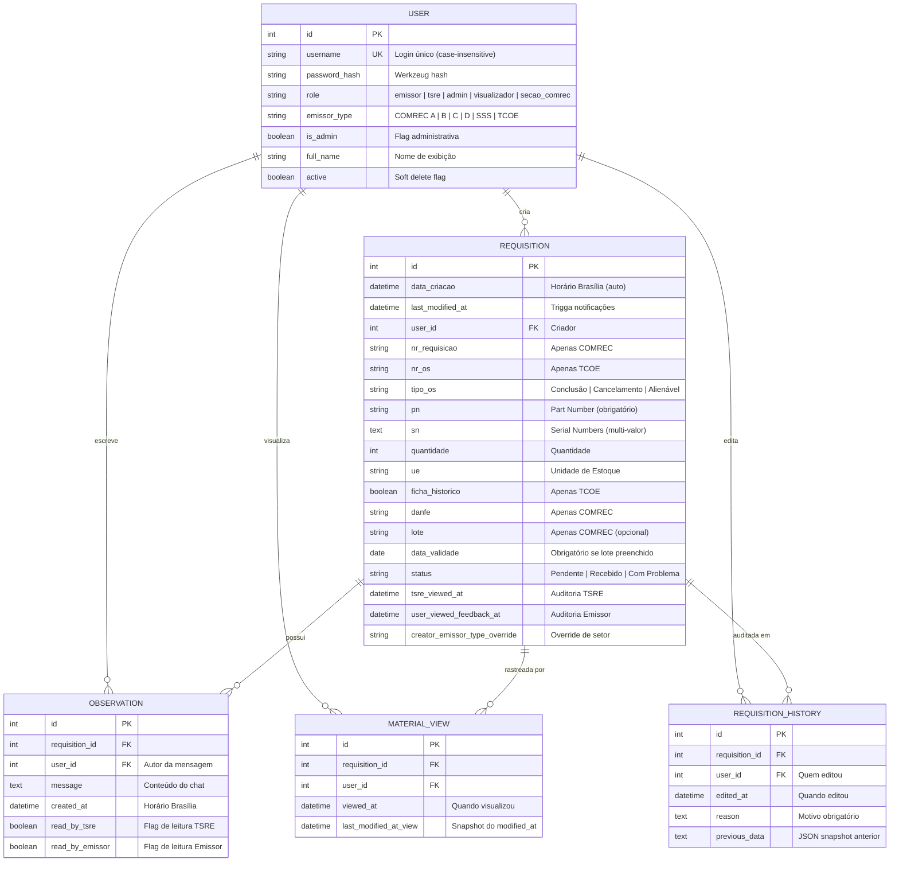

<p align="center">
  
  
  
  
  
</p>

<h1 align="center">📦 Sistema ComRec — Controle de Materiais e Recebimento</h1>

<p align="center">
  <strong>Plataforma web completa para gestão de requisições de materiais, conferência de recebimento e comunicação inter-setorial em organizações militares.</strong>
</p>

<p align="center">
  <em>Construído com Flask + SQLAlchemy + Bootstrap 5 · Autenticação RBAC · Notificações em tempo real · Relatórios PDF/Excel · Deploy PythonAnywhere</em>
</p>

---

## 📋 Índice

- [Visão Geral](#-visão-geral)
- [Funcionalidades Principais](#-funcionalidades-principais)
- [Arquitetura do Sistema](#-arquitetura-do-sistema)
- [Stack Tecnológica](#-stack-tecnológica)
- [Modelo de Dados (ERD)](#-modelo-de-dados-erd)
- [Sistema RBAC — Controle de Acesso por Perfil](#-sistema-rbac--controle-de-acesso-por-perfil)
- [Sistema de Notificações](#-sistema-de-notificações)
- [Rotas e Endpoints](#-rotas-e-endpoints)
- [Estrutura de Diretórios](#-estrutura-de-diretórios)
- [Instalação e Execução Local](#-instalação-e-execução-local)
- [Deploy em Produção (PythonAnywhere)](#-deploy-em-produção-pythonanywhere)
- [Credenciais Padrão](#-credenciais-padrão)
- [Testes e Qualidade](#-testes-e-qualidade)
- [Troubleshooting](#-troubleshooting)
- [Histórico de Versões](#-histórico-de-versões)
- [Licença](#-licença)

---

## 🎯 Visão Geral

O **Sistema ComRec** é uma aplicação web interna desenvolvida para a **Seção de Recebimento** de organizações militares, com o objetivo de digitalizar e rastrear o fluxo completo de requisições de materiais — desde o cadastro pelo setor emissor até a conferência física pela equipe TSRE.

### Problema Resolvido

Antes do ComRec, o controle de recebimento de materiais era feito de forma manual (planilhas Excel compartilhadas, formulários de papel), gerando:

- ❌ Perda de rastreabilidade (quem cadastrou? quem conferiu?)
- ❌ Duplicidade de dados e inconsistências de status
- ❌ Falta de comunicação estruturada entre setores emissores e a TSRE
- ❌ Impossibilidade de auditoria retroativa

### Solução

O ComRec oferece uma plataforma centralizada, com controle de acesso por perfil (RBAC), sistema de chat por requisição, notificações inteligentes, geração de relatórios PDF/Excel e auditoria completa de edições.

---

## ✨ Funcionalidades Principais

### 📥 Gestão de Requisições
| Funcionalidade | Descrição |
|:---|:---|
| **Cadastro COMREC** | Nº Requisição, PN, SN, Quantidade, UE, DANFE, Lote, Data de Validade |
| **Cadastro TCOE** | Nº OS, Tipo de OS (Conclusão/Cancelamento/Alienável), PN, SN, Ficha Histórico |
| **Formulários Dinâmicos** | O formulário de cadastro muda automaticamente conforme o tipo de emissor |
| **Validação Condicional** | Se Lote for informado, Data de Validade torna-se obrigatória |
| **Alerta de Lote Vencido** | Observação automática do sistema quando item é cadastrado com lote vencido |

### 🔄 Fluxo de Status
```
┌──────────┐     TSRE confere      ┌──────────┐
│ Pendente │ ──────────────────▶   │ Recebido │
└──────────┘                       └──────────┘
      │                                  
      │  TSRE identifica problema        
      ▼                                  
┌──────────────┐   Emissor corrige   ┌──────────┐
│ Com Problema │ ──────────────────▶ │ Pendente │
└──────────────┘                     └──────────┘
```

### 💬 Sistema de Chat (Observações)
- Chat integrado por requisição com histórico completo
- Indicadores visuais de mensagens não lidas (badges 🔴)
- Observações automáticas do sistema em eventos relevantes
- **Observações em Massa** — TSRE pode enviar mensagem para múltiplas requisições simultaneamente

### 🔔 Notificações Inteligentes
- Flags visuais individuais por usuário (não-compartilhados)
- Contadores de requisições novas, mensagens não lidas e problemas pendentes
- Badges no dashboard indicando itens que requerem atenção
- Marcação automática como "lido" ao visualizar detalhes

### 📊 Relatórios e Exportações
| Tipo | Formato | Descrição |
|:---|:---|:---|
| **Relatório de Conferência** | PDF (Paisagem A4) | Tabela para conferência física com checkbox "Confere" |
| **Exportação de Dados** | Excel (.xlsx) | Filtros por status, período e emissor com formatação profissional |

### 👥 Gestão de Usuários (Admin)
- Criação, desativação e reativação de contas
- Reset de senha administrativo
- **Soft Delete** — usuários com histórico são desativados (não excluídos)
- Verificação case-insensitive para evitar duplicidade de usernames
- Suporte a múltiplos usuários por setor com visibilidade compartilhada

### 🛡️ Auditoria e Segurança
- Log de edições com snapshot do estado anterior (JSON)
- Motivo de edição obrigatório para alterações via Seção COMREC
- Isolamento de dados por setor — COMREC A nunca vê dados da COMREC B
- Hashing de senhas com Werkzeug `generate_password_hash`

---

## 🏗️ Arquitetura do Sistema

```
┌───────────────────────────────────────────────────────┐
│                    CAMADA DE APRESENTAÇÃO              │
│                                                       │
│  ┌─────────────┐  ┌──────────────┐  ┌──────────────┐ │
│  │ login.html  │  │ base.html    │  │ dashboard_*  │ │
│  │             │  │ (layout)     │  │ (5 dashboards│ │
│  └─────────────┘  └──────────────┘  │  por perfil) │ │
│                                     └──────────────┘ │
│  Templates Jinja2 + Bootstrap 5 + Bootstrap Icons     │
│  Filtros Custom: status_equals | count_by_status      │
│                  filter_by_status                     │
├───────────────────────────────────────────────────────┤
│                    CAMADA DE APLICAÇÃO                 │
│                                                       │
│  ┌─────────────────────────────────────────────────┐  │
│  │                   app.py (1826 linhas)          │  │
│  │                                                 │  │
│  │  • Rotas de Autenticação (login/logout/senha)  │  │
│  │  • Rotas de Dashboard (5 dashboards RBAC)      │  │
│  │  • Rotas de Requisição (CRUD + status)         │  │
│  │  • Rotas de Observação (chat + bulk)           │  │
│  │  • Rotas de Relatórios (PDF + Excel)           │  │
│  │  • Rotas de Admin (gestão de usuários)         │  │
│  │  • Context Processors (notificações globais)   │  │
│  │  • Filtros Jinja2 customizados                 │  │
│  │  • Funções auxiliares (normalização, métricas) │  │
│  └─────────────────────────────────────────────────┘  │
│                                                       │
│  Flask + Flask-Login + Flask-SQLAlchemy               │
├───────────────────────────────────────────────────────┤
│                    CAMADA DE DADOS                     │
│                                                       │
│  ┌─────────────────────────────────────────────────┐  │
│  │              models.py (245 linhas)             │  │
│  │                                                 │  │
│  │  • User (autenticação + RBAC)                  │  │
│  │  • Requisition (materiais + STATUS workflow)   │  │
│  │  • Observation (chat bidrecional)              │  │
│  │  • MaterialView (tracking de leitura)          │  │
│  │  • RequisitionHistory (auditoria de edições)   │  │
│  └─────────────────────────────────────────────────┘  │
│                                                       │
│  SQLAlchemy ORM → SQLite (comrec.db)                  │
└───────────────────────────────────────────────────────┘
```

---

## 🛠️ Stack Tecnológica

### Backend
| Tecnologia | Versão | Propósito |
|:---|:---|:---|
| **Python** | 3.8+ | Linguagem principal |
| **Flask** | 3.0.0 | Framework web (microframework) |
| **Flask-SQLAlchemy** | 3.1.1 | ORM para abstração do banco de dados |
| **Flask-Login** | 0.6.3 | Gerenciamento de sessões e autenticação |
| **Werkzeug** | 3.0.1 | Hashing de senhas e utilitários HTTP |
| **SQLite** | Built-in | Banco de dados relacional embarcado |
| **fpdf** | 1.7.2 | Geração de relatórios PDF |
| **openpyxl** | 3.1.2 | Geração de planilhas Excel (.xlsx) |
| **pytz** | 2023.3 | Fuso horário de Brasília (America/Sao_Paulo) |

### Frontend
| Tecnologia | Versão | Propósito |
|:---|:---|:---|
| **Bootstrap** | 5.3.0 | Framework CSS responsivo |
| **Bootstrap Icons** | 1.10.0 | Iconografia consistente |
| **Jinja2** | (built-in) | Engine de templates server-side |
| **LocalStorage API** | Nativo | Persistência de estado de abas |

### Deploy
| Plataforma | Tipo | Propósito |
|:---|:---|:---|
| **PythonAnywhere** | PaaS | Hospedagem de produção (WSGI) |
| **Windows (local)** | Script .bat | Desenvolvimento e testes |

---

## 📐 Modelo de Dados (ERD)



### Campos Condicionais por Tipo de Emissor

| Campo | COMREC (A/B/C/D/SSS) | TCOE |
|:---|:---:|:---:|
| `nr_requisicao` | ✅ Obrigatório | ❌ Não usado |
| `danfe` | ✅ Obrigatório | ❌ Não usado |
| `lote` | ⚪ Opcional | ❌ Não usado |
| `data_validade` | ⚪ Condicional (se lote) | ❌ Não usado |
| `nr_os` | ❌ Não usado | ✅ Obrigatório |
| `tipo_os` | ❌ Não usado | ✅ Obrigatório |
| `ficha_historico` | ❌ Não usado | ⚪ Opcional |
| `sn` | ⚪ Opcional | ✅ Obrigatório |

---

## 🔐 Sistema RBAC — Controle de Acesso por Perfil

O sistema implementa **5 perfis de acesso (roles)** com permissões granulares:

### Matriz de Permissões

| Permissão | `admin` | `tsre` | `emissor` | `secao_comrec` | `visualizador` |
|:---|:---:|:---:|:---:|:---:|:---:|
| Criar requisições | ❌ | ❌ | ✅ (próprio setor) | ✅ (qualquer setor) | ❌ |
| Visualizar requisições | ✅ (todas) | ✅ (todas) | ✅ (próprio setor) | ✅ (todas) | ✅ (todas) |
| Alterar status | ❌ | ✅ | ❌ | ❌ | ❌ |
| Editar dados da requisição | ❌ | ❌ | ❌ | ✅ (com motivo) | ❌ |
| Excluir requisições | ✅ | ❌ | ❌ | ❌ | ❌ |
| Enviar observações | ❌ | ✅ (qualquer) | ✅ (próprias) | ✅ | ❌ |
| Observação em massa | ❌ | ✅ | ❌ | ❌ | ❌ |
| Gerar PDF de conferência | ❌ | ✅ | ❌ | ❌ | ❌ |
| Exportar Excel | ✅ | ✅ | ✅ (próprio setor) | ✅ | ✅ |
| Gestão de usuários | ✅ | ❌ | ❌ | ❌ | ❌ |
| Receber notificações | ⚪ (métricas) | ✅ (completas) | ✅ (próprio setor) | ✅ (globais) | ❌ |

### Descrição dos Perfis

| Perfil | Dashboard | Propósito |
|:---|:---|:---|
| **Admin** | `dashboard_admin` | Visão holística do sistema com métricas globais, gestão de usuários, exclusão de requisições e auditoria |
| **TSRE** | `dashboard_tsre` | Conferência de materiais recebidos. Altera status, envia observações, gera PDFs, seleção em massa |
| **Emissor** | `dashboard_emissor` | Cadastro de novas requisições de materiais do seu setor. Visualiza feedback da TSRE |
| **Seção COMREC** | `dashboard_secao_comrec` | Supervisão global. Pode criar requisições em nome de qualquer setor, editar dados com auditoria |
| **Visualizador** | `dashboard_visualizador` | Acesso somente leitura a todas as requisições. Ideal para gestores e auditores |

### Visibilidade Compartilhada por Setor (v2.0)

```
COMREC D
├── sgt_patricio   ← cria requisição #42
├── cb_silva        ← vê requisição #42 no seu dashboard
└── sd_santos       ← também vê requisição #42

COMREC A
└── militar_jose    ← NÃO vê requisição #42 (setor diferente)
```

---

## 🔔 Sistema de Notificações

O sistema implementa notificações **individualizadas** por usuário utilizando a tabela `MaterialView` e flags booleanos nas `Observation`.

### Métricas por Perfil (`get_unread_metrics`)

| Métrica | TSRE | Emissor | Seção COMREC | Admin |
|:---|:---|:---|:---|:---|
| `new_requisitions` | Requisições nunca vistas (global) | — | — | — |
| `unread_messages` | De emissores/seção | Da TSRE (próprias reqs) | Da TSRE (global) | — |
| `problem_requisitions` | — | "Com Problema" (próprias) | "Com Problema" (global) | — |
| `total_notifications` | Soma de novos + mensagens | Total de mensagens | Total de mensagens | 0 |

### Indicadores Visuais

| Indicador | Significado |
|:---|:---|
| 🔴 Badge "Novo" | Requisição nunca visualizada pelo usuário |
| 🔔 Sino com Contador | Total de itens pendentes de atenção |
| 🟨 Linha Amarela (`unread-row`) | Destaque visual para itens com alterações pendentes |
| ✉️ Badge de Envelope | Requisição com mensagens não lidas |

### Lógica de Primeiro Acesso

Na primeira vez que um usuário faz login, o sistema **marca automaticamente todas as requisições existentes como lidas**, evitando que o usuário seja bombardeado com notificações históricas.

---

## 🗺️ Rotas e Endpoints

### Autenticação
| Método | Rota | Função | Requer Login |
|:---|:---|:---|:---:|
| `GET/POST` | `/login` | Página de login | ❌ |
| `GET` | `/logout` | Encerrar sessão | ✅ |
| `GET/POST` | `/change-password` | Alterar senha pessoal | ✅ |

### Dashboards (Redirecionamento Automático por Role)
| Método | Rota | Role | Descrição |
|:---|:---|:---|:---|
| `GET` | `/dashboard` | Todos | Redireciona para dashboard do perfil |
| `GET` | `/dashboard/admin` | admin | Métricas globais + auditoria |
| `GET` | `/dashboard/tsre` | tsre | Conferência + alteração de status |
| `GET` | `/dashboard/emissor` | emissor | Cadastro + acompanhamento |
| `GET` | `/dashboard/secao_comrec` | secao_comrec | Supervisão + edição |
| `GET` | `/dashboard/visualizador` | visualizador | Somente leitura |

### Requisições
| Método | Rota | Função | Roles |
|:---|:---|:---|:---|
| `POST` | `/requisition/new` | Criar requisição | emissor, secao_comrec |
| `GET` | `/requisition/<id>` | Ver detalhes | Todos (com filtro de setor) |
| `POST` | `/requisition/<id>/status` | Alterar status | tsre |
| `POST` | `/requisition/<id>/observation` | Adicionar chat | emissor, tsre, secao_comrec |
| `POST` | `/requisition/<id>/update` | Editar dados | secao_comrec |
| `POST` | `/requisition/<id>/delete` | Excluir permanente | admin |
| `POST` | `/requisition/bulk-observation` | Chat em massa | tsre |
| `POST` | `/requisition/bulk-view` | Marcar como lido | tsre, emissor, secao_comrec |

### Relatórios
| Método | Rota | Formato | Roles |
|:---|:---|:---|:---|
| `POST` | `/report/pdf` | PDF (Paisagem A4) | tsre |
| `POST` | `/report/excel` | Excel (.xlsx) | Todos (com filtro de setor) |

### Gestão de Usuários (Admin)
| Método | Rota | Função |
|:---|:---|:---|
| `GET` | `/admin/users` | Listar usuários (ativos/inativos) |
| `POST` | `/admin/users/create` | Criar novo usuário |
| `POST` | `/admin/users/<id>/delete` | Desativar/excluir usuário |
| `POST` | `/admin/users/<id>/reset-password` | Resetar senha |

---

## 📁 Estrutura de Diretórios

```
CHAREC/
├── .gitignore                          # Regras de exclusão do Git
├── README.md                           # ◀ Este arquivo
├── README_NOTIFICACOES_TSRE.md         # Documentação do sistema de notificações
├── README_USUARIOS.md                  # Guia de gestão de usuários (modelo individual)
├── requirements.txt                    # Dependências do ambiente virtual raiz
├── run_local.bat                       # Script de execução local (Windows)
│
└── mysite/                             # ◀ APLICAÇÃO PRINCIPAL
    ├── app.py                          # Core Flask (1826 linhas — rotas, lógica, relatórios)
    ├── models.py                       # Modelos SQLAlchemy (User, Requisition, Observation, etc.)
    ├── requirements.txt                # Dependências Python do projeto
    ├── wsgi_pythonanywhere.py          # Configuração WSGI para deploy PythonAnywhere
    │
    ├── templates/                      # Templates HTML (Jinja2 + Bootstrap 5)
    │   ├── base.html                   # Layout base (navbar, flash messages, CSS global)
    │   ├── login.html                  # Página de autenticação
    │   ├── change_password.html        # Formulário de alteração de senha
    │   ├── dashboard_admin.html        # Dashboard administrativo
    │   ├── dashboard_tsre.html         # Dashboard de conferência (TSRE)
    │   ├── dashboard_emissor.html      # Dashboard de emissores (COMREC/TCOE)
    │   ├── dashboard_secao_comrec.html # Dashboard de supervisão (Seção COMREC)
    │   ├── dashboard_visualizador.html # Dashboard read-only
    │   ├── admin_users.html            # Gestão de usuários
    │   └── requisition_detail.html     # Detalhes + chat da requisição
    │
    ├── instance/                       # Banco de dados SQLite (criado automaticamente)
    │   └── comrec.db                   # Arquivo do banco (gitignored)
    │
    ├── __pycache__/                    # Cache Python (gitignored)
    │
    ├── ── Scripts de Migração ──
    │   ├── migrate_to_v2.py            # Migração principal v1 → v2
    │   ├── migrate_tipo_os.py          # Migração do campo tipo_os (TCOE)
    │   ├── fix_db_schema.py            # Correções de schema
    │   ├── fix_status_normalization.py # Normalização de status case-insensitive
    │   ├── update_db_v2_3.py           # Atualizações para v2.3
    │   ├── apply_v21_updates.py        # Atualizações para v2.1
    │   ├── add_visualizador.py         # Adicionar perfil visualizador
    │   ├── remove_id_columns.py        # Limpeza de colunas obsoletas
    │   └── sql_updates_lote_validade.sql # SQL para campos lote/validade
    │
    ├── ── Scripts de Inspeção ──
    │   ├── inspect_db.py               # Inspeção geral do banco
    │   ├── inspect_db_v2.py            # Inspeção v2
    │   ├── inspect_db_pt2.py           # Inspeção complementar
    │   ├── inspect_db_file.py          # Inspeção de arquivo do banco
    │   ├── inspect_columns.py          # Inspeção de colunas
    │   ├── verify_migration.py         # Verificação de migração
    │   └── verify_app_db_context.py    # Verificação de contexto DB
    │
    ├── ── Scripts de Teste ──
    │   ├── test_bug_fixes.py           # Testes de correções de bugs
    │   └── CODIGO_CORRIGIDO_REFERENCIA.py # Código de referência corrigido
    │
    └── ── Documentação Interna ──
        ├── DEPLOY_GUIDE.md             # Guia de deploy PythonAnywhere
        ├── UPGRADE_GUIDE.md            # Guia de atualização de versão
        ├── UPDATE_GUIDE.md             # Guia de updates pontuais
        ├── COMANDOS_RAPIDOS.md         # Cheatsheet de comandos
        ├── DEMO.md                     # Guia de demonstração
        ├── ENTREGA_FINAL.md            # Documentação de entrega v1
        ├── ENTREGA_V2.md               # Documentação de entrega v2
        ├── AJUSTES_V2.1.md             # Changelog v2.1
        ├── AJUSTES_V2.2.md             # Changelog v2.2
        ├── CORREÇÕES_BUGS.md           # Registro de bugs corrigidos
        ├── CORRECAO_BUG_TCOE_v2.2.2.md # Bug fix TCOE específico
        ├── CORRECOES_UI_v2.2.1.md      # Correções de UI
        └── BUSCA_AVANÇADA_FRONTEND.md  # Documentação da busca avançada
```

---

## 💻 Instalação e Execução Local

### Pré-requisitos

- **Python 3.8+** instalado e disponível no `PATH` do Windows
- **pip** (gerenciador de pacotes Python)
- **Git** (opcional, para clonagem do repositório)

### Método 1: Script Automatizado (Recomendado)

```bash
# 1. Clone o repositório (ou copie a pasta)
git clone <url-do-repositório> CHAREC
cd CHAREC

# 2. Crie o ambiente virtual (apenas na primeira vez)
python -m venv .venv

# 3. Execute o script
run_local.bat
```

O script `run_local.bat` automaticamente:
- ✅ Verifica a existência do ambiente virtual
- ✅ Ativa o ambiente virtual
- ✅ Instala/verifica todas as dependências
- ✅ Inicia o servidor Flask na porta 5000

### Método 2: Execução Manual

```bash
# 1. Criar ambiente virtual
python -m venv .venv

# 2. Ativar ambiente virtual (Windows)
.venv\Scripts\activate

# 3. Instalar dependências
pip install -r mysite/requirements.txt

# 4. Executar aplicação
python mysite/app.py
```

### Após a Execução

```
✓ Servidor iniciado em: http://127.0.0.1:5000
✓ Banco de dados criado automaticamente em: mysite/instance/comrec.db
✓ Usuários padrão criados na primeira execução
```

---

## 🚀 Deploy em Produção (PythonAnywhere)

### Passo a Passo

1. **Criar conta** em [pythonanywhere.com](https://www.pythonanywhere.com)

2. **Upload dos arquivos** via aba "Files":
   ```
   /home/seu_usuario/mysite/
   ├── app.py
   ├── models.py
   ├── requirements.txt
   └── templates/
       └── (todos os .html)
   ```

3. **Criar virtualenv** no console Bash:
   ```bash
   mkvirtualenv --python=/usr/bin/python3.8 comrec-env
   pip install -r /home/seu_usuario/mysite/requirements.txt
   ```

4. **Configurar Web App**:
   - Web → Add a new web app → Manual Configuration → Python 3.8
   - Source code: `/home/seu_usuario/mysite`
   - Virtualenv: `/home/seu_usuario/.virtualenvs/comrec-env`

5. **Configurar WSGI** (copiar conteúdo de `wsgi_pythonanywhere.py`):
   - Substituir `seu_usuario` pelo username real
   - Salvar e clicar em "Reload"

6. **Acessar**: `https://seu_usuario.pythonanywhere.com`

### Variáveis de Ambiente Recomendadas

```python
# Em produção, mover SECRET_KEY para variável de ambiente:
export SECRET_KEY='sua-chave-secreta-de-producao-muito-forte'

# No app.py, substituir:
app.config['SECRET_KEY'] = os.environ.get('SECRET_KEY', 'fallback-dev-key')
```

---

## 🔑 Credenciais Padrão

> ⚠️ **ATENÇÃO**: Altere todas as senhas após a primeira utilização!

| Perfil | Username | Senha | Role | Setor |
|:---|:---|:---|:---|:---|
| Administrador | `admin` | `admin` | `admin` | — |
| Visualizador | `visualizador` | `123` | `visualizador` | — |
| TSRE | `tsre` | `123` | `tsre` | — |
| Emissor COMREC A | `comreca` | `123` | `emissor` | COMREC A |
| Emissor COMREC B | `comrecb` | `123` | `emissor` | COMREC B |
| Emissor COMREC C | `comrecc` | `123` | `emissor` | COMREC C |
| Emissor COMREC D | `comrecd` | `123` | `emissor` | COMREC D |
| Emissor COMREC SSS | `comrecsss` | `123` | `emissor` | COMREC SSS |
| Emissor TCOE | `tcoe` | `123` | `emissor` | TCOE |

---

## 🧪 Testes e Qualidade

### Testes Disponíveis

```bash
# Executar testes de correção de bugs
python mysite/test_bug_fixes.py

# Verificar integridade do banco de dados
python mysite/inspect_db.py

# Verificar migração aplicada corretamente
python mysite/verify_migration.py
```

### Normalização de Status

O sistema possui proteção contra inconsistências de case nos status:

```python
# normalize_status() garante:
"pendente"      → "Pendente"
"RECEBIDO"      → "Recebido"
"com problemas" → "Com Problema"    # Inclusive variações
"Com Problema"  → "Com Problema"
```

Queries no banco utilizam `func.lower()` para comparação case-insensitive, garantindo que contadores nunca fiquem zerados por variações de capitalização.

---

## 🔧 Troubleshooting

### Erro: "Ambiente virtual não encontrado"
```bash
# Certifique-se de que o Python está no PATH
python --version

# Recrie o ambiente se necessário
python -m venv .venv
```

### Erro 500 ou Banco de Dados não encontrado
```bash
# O diretório instance deve ser criado automaticamente
# Se persistir, crie manualmente:
mkdir mysite\instance

# Re-execute a aplicação para gerar o banco
python mysite/app.py
```

### Contadores zerados no Dashboard Admin
```bash
# Execute o script de normalização de status
python mysite/fix_status_normalization.py
```

### Erro de migração após update
```bash
# Inspeção do estado atual do banco
python mysite/inspect_db_v2.py

# Aplicar migração pendente
python mysite/update_db_v2_3.py
```

### Deploy PythonAnywhere — Erro 500
1. Verifique os **Error Logs**: `Web → Log files → Error log`
2. Confirme que o `project_home` no WSGI está correto
3. Verifique se o virtualenv está configurado na aba Web
4. Execute `pip install -r requirements.txt` no console PythonAnywhere

---

## 📦 Histórico de Versões

| Versão | Descrição | Destaques |
|:---|:---|:---|
| **v1.0** | Versão inicial | Cadastro básico COMREC, login simples, PDF |
| **v2.0** | Refatoração completa | RBAC multi-perfil, visibilidade por setor, usuários individuais |
| **v2.1** | Melhorias de UX | Busca avançada, abas persistentes, filtros por emissor |
| **v2.2** | Bugs e estabilidade | Normalização de status, correção de contadores, filtros Jinja2 custom |
| **v2.2.1** | Correções de UI | Ajustes visuais no dashboard, z-index de modais |
| **v2.2.2** | Bug fix TCOE | Correção de bug específico no formulário TCOE |
| **v2.3** | Sistema de notificações | MaterialView tracking, notificações individuais, observações em massa |
| **v2.3+** | Seção COMREC + Auditoria | Perfil secao_comrec, histórico de edições, soft delete de usuários, lote/validade |

---

## 📄 Licença

Este projeto é um software interno desenvolvido sob demanda para uso organizacional restrito. Todos os direitos reservados.

---

<p align="center">
  <sub>Desenvolvido com ❤️ para a Seção de Recebimento · Sistema ComRec v2.3+</sub>
</p>
