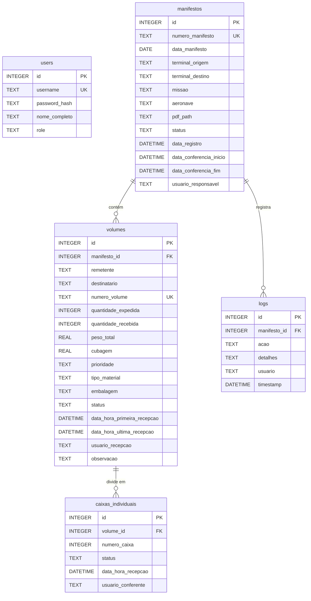
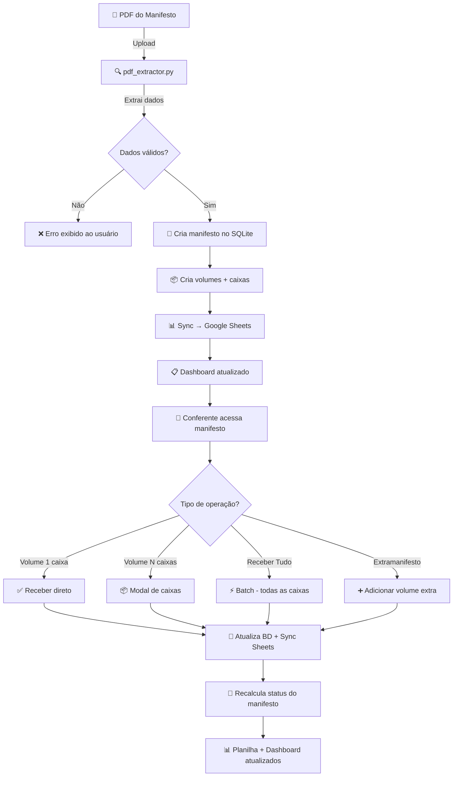

<p align="center">
  
</p>

<h1 align="center">✈️ ConCAN — Conferência CAN</h1>

<p align="center">
  <strong>Sistema de Conferência de Manifestos de Carga Aeronáutica</strong><br>
  <em>Força Aérea Brasileira — PAMALS (Parque de Material Aeronáutico de Lagoa Santa)</em>
</p>

<p align="center">
  
  
  
  
  
  
  
</p>

---

## 📋 Índice

1.  [Visão Geral](#-visão-geral)
2.  [Principais Funcionalidades](#-principais-funcionalidades)
3.  [Arquitetura do Sistema](#-arquitetura-do-sistema)
4.  [Stack Tecnológica](#-stack-tecnológica)
5.  [Estrutura de Diretórios](#-estrutura-de-diretórios)
6.  [Modelagem do Banco de Dados](#-modelagem-do-banco-de-dados)
7.  [Módulos do Backend](#-módulos-do-backend)
    - [app.py — Servidor Flask](#apppyservidor-flask)
    - [database.py — Camada de Dados](#databasepycamada-de-dados)
    - [pdf_extractor.py — Extração Inteligente de PDF](#pdf_extractorpyextração-inteligente-de-pdf)
    - [sheets_sync.py — Sincronização com Google Sheets](#sheets_syncpysincronização-com-google-sheets)
8.  [API REST (Endpoints AJAX)](#-api-rest-endpoints-ajax)
9.  [Frontend & Templates](#-frontend--templates)
10. [Progressive Web App (PWA)](#-progressive-web-app-pwa)
11. [Sistema de Autenticação & RBAC](#-sistema-de-autenticação--rbac)
12. [Fluxo Operacional Completo](#-fluxo-operacional-completo)
13. [Configuração do Ambiente](#-configuração-do-ambiente)
14. [Configuração do Google Sheets](#-configuração-do-google-sheets)
15. [Execução Local](#-execução-local)
16. [Deploy em Produção](#-deploy-em-produção)
17. [Referência de Status e Cores](#-referência-de-status-e-cores)
18. [Considerações de Segurança](#-considerações-de-segurança)
19. [Licença](#-licença)

---

## 🎯 Visão Geral

O **ConCAN** (Conferência CAN — Correio Aéreo Nacional) é um sistema web completo desenvolvido para digitalizar e automatizar o processo de conferência de manifestos de carga aeronáutica do PAMALS. O sistema substitui o controle manual em papel e planilhas desconectadas por uma plataforma web moderna, mobile-first e instalável como aplicativo (PWA).

### Problema Resolvido

Anteriormente, a conferência de cargas aeronáuticas no PAMALS era realizada manualmente:
- Conferentes verificavam volumes contra documentos impressos em papel
- O rastreamento de status era feito de forma descentralizada
- Não havia visibilidade em tempo real do progresso das conferências
- Volumes extras (extramanifesto) eram anotados à mão sem padronização

### Solução Implementada

O ConCAN resolve todos esses problemas:
- **Importação automática** de manifestos via upload de PDF
- **Conferência digital** de volumes e caixas individuais via interface mobile-first
- **Rastreamento em tempo real** com sincronização automática ao Google Sheets
- **Extramanifesto digital** para registrar volumes não previstos no manifesto original
- **Controle de acesso** com sistema de autenticação e papéis (Admin/Operador)
- **Instalável como app** via PWA (Progressive Web App) em Android e iOS

---

## 🚀 Principais Funcionalidades

### 📄 Gestão de Manifestos
| Funcionalidade | Descrição |
|---|---|
| **Upload de PDF** | Importação automática via extração inteligente de dados de manifestos em PDF |
| **Listagem com Progresso** | Dashboard com barra de progresso visual para cada manifesto |
| **Busca Avançada** | Filtros por número, data, status; busca global de volumes |
| **Detalhamento** | Modal com visualização completa de todos os volumes de um manifesto |
| **Exclusão Protegida** | Remoção com exigência de senha administrativa |

### 📦 Conferência de Volumes
| Funcionalidade | Descrição |
|---|---|
| **Recebimento Individual** | Marcar volume como recebido com registro de conferente e timestamp |
| **Recebimento de Caixas** | Suporte a volumes com múltiplas caixas (ex: 1/50) — conferência caixa a caixa |
| **Receber Tudo (Volume)** | Atalho para marcar todas as caixas de um volume de uma vez |
| **Receber Tudo (Manifesto)** | Atalho para receber todos os volumes do manifesto inteiro |
| **Desfazer Recebimento** | Reversão de conferência com controle de sessão e senha admin |
| **Extramanifesto** | Adição de volumes não previstos diretamente na tela de conferência |
| **Observações** | Campo de texto livre por volume para anotar avarias, divergências etc. |

### 👥 Gestão de Usuários
| Funcionalidade | Descrição |
|---|---|
| **Autenticação** | Login/Logout com Flask-Login e hashing Werkzeug |
| **Dois Papéis** | `admin` (acesso total) e `operador` (conferência apenas) |
| **CRUD de Usuários** | Criação, listagem e exclusão de usuários (admin only) |
| **Alteração de Senha** | Self-service com validação de senha atual |

### 🔗 Integrações
| Funcionalidade | Descrição |
|---|---|
| **Google Sheets** | Sincronização automática e assíncrona via `gspread` |
| **Formatação Visual** | Planilha com cores de status, cabeçalhos profissionais e auto-resize |
| **Resiliência** | Retry com backoff exponencial e worker thread dedicado |

---

## 🏗 Arquitetura do Sistema

```
┌─────────────────────────────────────────────────────────────────────┐
│                        CLIENTE (Browser / PWA)                      │
│  ┌──────────┐  ┌──────────┐  ┌──────────┐  ┌───────────────────┐   │
│  │  Login   │  │  Index   │  │Conferência│  │  Busca Avançada  │   │
│  │  (HTML)  │  │  (HTML)  │  │  (HTML)   │  │     (HTML)       │   │
│  └────┬─────┘  └────┬─────┘  └─────┬─────┘  └───────┬─────────┘   │
│       │              │              │                │              │
│       │         ┌────┴──────────────┴────────────────┘              │
│       │         │    Fetch API (JSON) — Operações AJAX             │
└───────┼─────────┼──────────────────────────────────────────────────┘
        │         │
        ▼         ▼
┌─────────────────────────────────────────────────────────────────────┐
│                      SERVIDOR (Flask / Python)                      │
│                                                                     │
│  ┌──────────────────┐  ┌──────────────────┐  ┌──────────────────┐  │
│  │     app.py       │  │   database.py    │  │ pdf_extractor.py │  │
│  │  (Rotas HTTP)    │──│  (Camada de      │  │ (Parser de PDF   │  │
│  │  (Flask-Login)   │  │   Dados SQLite)  │  │  pdfplumber)     │  │
│  └──────────────────┘  └───────┬──────────┘  └──────────────────┘  │
│                                │                                    │
│                                │  Sync Assíncrono                   │
│                                ▼                                    │
│                     ┌──────────────────────┐                        │
│                     │   sheets_sync.py     │                        │
│                     │ (Worker Thread +     │                        │
│                     │  gspread API)        │                        │
│                     └──────────┬───────────┘                        │
└────────────────────────────────┼────────────────────────────────────┘
                                 │
                                 ▼
┌────────────────────────────────────────────────────────────────┐
│                 ARMAZENAMENTO                                  │
│  ┌──────────────┐          ┌────────────────────────────────┐  │
│  │  SQLite DB   │          │    Google Sheets (Cloud)       │  │
│  │ data/        │          │    Planilha de Controle        │  │
│  │ database.db  │          │    (Atualização em tempo real) │  │
│  └──────────────┘          └────────────────────────────────┘  │
└────────────────────────────────────────────────────────────────┘
```

O sistema segue uma **arquitetura monolítica server-rendered** com:
- **Flask** como servidor HTTP e framework de templates (Jinja2)
- **SQLite** como banco de dados embutido (zero configuração)
- **AJAX (Fetch API)** para operações interativas sem recarregar a página
- **Worker Thread** para sincronização assíncrona com Google Sheets (não bloqueia o usuário)

---

## 🛠 Stack Tecnológica

### Backend
| Tecnologia | Propósito |
|---|---|
| **Python 3.10+** | Linguagem principal do servidor |
| **Flask** | Framework web HTTP e template engine (Jinja2) |
| **Flask-Login** | Gerenciamento de sessões e autenticação |
| **Werkzeug** | Hashing seguro de senhas (`generate_password_hash` / `check_password_hash`) |
| **SQLite 3** | Banco de dados relacional embutido (zero config) |
| **pdfplumber** | Extração de texto e dados tabulares de PDFs |
| **gspread** | Client Python oficial para a API do Google Sheets |
| **oauth2client** | Autenticação OAuth2 via Service Account (Google API) |
| **python-dateutil** | Parsing avançado de datas ISO 8601 |

### Frontend
| Tecnologia | Propósito |
|---|---|
| **HTML5 (Jinja2)** | Templates server-rendered |
| **Bootstrap 5.3** | Framework CSS responsivo (via CDN) |
| **Bootstrap Icons** | Iconografia consistente (via CDN) |
| **JavaScript (Vanilla)** | Lógica do cliente, chamadas AJAX, modais interativos |
| **CSS Custom** | Estilizações específicas do sistema (botões, cores, animações) |

### Infraestrutura
| Tecnologia | Propósito |
|---|---|
| **Service Worker** | Habilita funcionalidades PWA |
| **Web App Manifest** | Configuração do PWA (ícone, nome, cores) |
| **Google Sheets API** | Backend de visualização/reporting externo |

---

## 📁 Estrutura de Diretórios

```
ConCAN/
├── app.py                      # 🟢 Ponto de entrada — Servidor Flask (rotas, auth, API)
├── criar_admin.py              # 🔧 Script utilitário para criar usuário admin inicial
├── requirements.txt            # 📦 Dependências Python do projeto
├── credentials.json            # 🔑 Credenciais do Service Account Google (placeholder)
│
├── src/                        # 📂 Módulos de negócio
│   ├── database.py             #    └─ Camada de acesso a dados (SQLite) + Auth + Sync
│   ├── pdf_extractor.py        #    └─ Parser inteligente de manifestos em PDF
│   └── sheets_sync.py          #    └─ Sincronização assíncrona com Google Sheets
│
├── templates/                  # 📂 Templates Jinja2 (HTML)
│   ├── base.html               #    └─ Layout base (navbar, PWA, help modal)
│   ├── login.html              #    └─ Página de autenticação
│   ├── index.html              #    └─ Dashboard — Lista de manifestos com ações
│   ├── conferencia.html        #    └─ Tela de conferência de volumes (a principal)
│   ├── busca.html              #    └─ Busca avançada (manifestos + volumes)
│   ├── novo.html               #    └─ Upload/importação de PDF
│   ├── perfil.html             #    └─ Alteração de senha (self-service)
│   └── usuarios.html           #    └─ Gestão de usuários (admin only)
│
├── static/                     # 📂 Arquivos estáticos
│   ├── manifest.json           #    └─ Configuração do PWA
│   ├── sw.js                   #    └─ Service Worker
│   └── images/                 #    └─ Ícones do PWA
│       ├── icon-192.png        #        └─ Ícone 192x192 (Android/iOS)
│       └── icon-512.png        #        └─ Ícone 512x512 (splash screen)
│
├── data/                       # 📂 Diretório do banco de dados
│   └── database.db             #    └─ Banco SQLite (criado automaticamente)
│
└── uploads/                    # 📂 PDFs enviados (criado automaticamente em runtime)
```

---

## 🗄 Modelagem do Banco de Dados

O sistema utiliza **SQLite** com 4 tabelas inter-relacionadas:



### Detalhamento das Tabelas

#### `users` — Usuários do Sistema
| Coluna | Tipo | Descrição |
|---|---|---|
| `id` | INTEGER PK | Identificador auto-incremento |
| `username` | TEXT UNIQUE | Login do usuário |
| `password_hash` | TEXT | Hash Werkzeug da senha |
| `nome_completo` | TEXT | Nome de exibição (posto + nome) |
| `role` | TEXT | `'admin'` ou `'operador'` |

#### `manifestos` — Manifestos de Carga
| Coluna | Tipo | Descrição |
|---|---|---|
| `id` | INTEGER PK | Identificador auto-incremento |
| `numero_manifesto` | TEXT UNIQUE | Número oficial do manifesto (12 dígitos) |
| `data_manifesto` | DATE | Data do manifesto (formato `DD/MM/YYYY`) |
| `terminal_origem` | TEXT | Terminal de origem (ex: `PCAN-BR`) |
| `terminal_destino` | TEXT | Terminal de destino (ex: `TCTL-LS`) |
| `missao` | TEXT | Código da missão aérea |
| `aeronave` | TEXT | Prefixo da aeronave |
| `pdf_path` | TEXT | Caminho local do PDF original |
| `status` | TEXT | Estado geral da conferência |

#### `volumes` — Volumes Individuais
| Coluna | Tipo | Descrição |
|---|---|---|
| `id` | INTEGER PK | Identificador auto-incremento |
| `manifesto_id` | INTEGER FK | Referência ao manifesto pai |
| `remetente` | TEXT | Organização militar remetente (padronizado) |
| `destinatario` | TEXT | Destinatário (filtrado por `PAMALS`) |
| `numero_volume` | TEXT | Número do volume (formato `XXXXXXXXXXXX/XXXX`) |
| `quantidade_expedida` | INTEGER | Total de caixas previstas |
| `quantidade_recebida` | INTEGER | Total de caixas conferidas |
| `peso_total` | REAL | Peso em kg |
| `cubagem` | REAL | Cubagem em m³ |
| `prioridade` | TEXT | Código de prioridade (2 dígitos) ou `EXTRA` |
| `tipo_material` | TEXT | Classificação do material |
| `embalagem` | TEXT | Tipo de embalagem |
| `status` | TEXT | `NÃO RECEBIDO`, `PARCIAL`, `COMPLETO` |
| `observacao` | TEXT | Anotação livre (avarias, divergências) |

#### `caixas_individuais` — Controle Granular por Caixa
| Coluna | Tipo | Descrição |
|---|---|---|
| `id` | INTEGER PK | Identificador auto-incremento |
| `volume_id` | INTEGER FK | Referência ao volume pai |
| `numero_caixa` | INTEGER | Número sequencial (1, 2, 3...) |
| `status` | TEXT | `NÃO RECEBIDA` ou `RECEBIDA` |
| `data_hora_recepcao` | DATETIME | Timestamp ISO 8601 (BRT) |
| `usuario_conferente` | TEXT | Nome do conferente |

---

## 🔧 Módulos do Backend

### `app.py` — Servidor Flask

O arquivo principal orquestra toda a aplicação:

**Responsabilidades:**
- Inicialização do Flask e Flask-Login
- Definição de todas as rotas HTTP (GET/POST)
- Rotas de API REST para operações AJAX
- Upload e processamento de PDFs
- Filtro Jinja2 customizado para formatação de datas

**Rotas de Página (Server-Rendered):**
| Rota | Método | Descrição | Acesso |
|---|---|---|---|
| `/login` | GET/POST | Autenticação de usuário | Público |
| `/logout` | GET | Encerrar sessão | Autenticado |
| `/` | GET | Dashboard — Lista de manifestos | Autenticado |
| `/novo` | GET | Formulário de upload de PDF | Autenticado |
| `/upload` | POST | Processamento do PDF enviado | Autenticado |
| `/conferencia/<id>` | GET | Tela de conferência de volumes | Autenticado |
| `/busca` | GET | Busca avançada | Autenticado |
| `/perfil` | GET/POST | Alteração de senha | Autenticado |
| `/usuarios` | GET/POST | Gestão de usuários (CRUD) | Admin |
| `/usuarios/excluir/<id>` | POST | Exclusão de usuário | Admin |
| `/excluir/<id>` | POST | Exclusão de manifesto | Admin |

---

### `database.py` — Camada de Dados

Módulo central da lógica de dados com ~470 linhas. Todas as operações de CRUD passam por este módulo.

**Funções de Autenticação:**
| Função | Descrição |
|---|---|
| `criar_usuario()` | Cria usuário com hash de senha seguro |
| `verificar_login()` | Valida credenciais e retorna dados do usuário |
| `obter_usuario_por_id()` | Carrega usuário por ID (Flask-Login) |
| `listar_todos_usuarios()` | Lista todos para o painel admin |
| `atualizar_senha()` | Atualiza hash da senha |
| `excluir_usuario_db()` | Remove usuário do banco |
| `verificar_senha_atual_db()` | Valida senha atual para troca |

**Funções de Manifesto/Volume:**
| Função | Descrição |
|---|---|
| `listar_manifestos()` | Lista com filtros (número, status, período) e agregações |
| `criar_manifesto()` | Insere manifesto + dispara sync Sheets |
| `adicionar_volume()` | Insere volume + cria caixas individuais + sync |
| `obter_manifesto()` | Busca manifesto por ID |
| `listar_volumes_detalhado()` | Lista volumes de um manifesto |
| `excluir_manifesto()` | Exclusão em cascata (logs → caixas → volumes → manifesto) |
| `obter_estatisticas_manifesto()` | Calcula totais e percentual de progresso |
| `buscar_volumes_geral()` | Busca global de volumes por número |

**Funções de Conferência:**
| Função | Descrição |
|---|---|
| `marcar_recebido_web()` | Marca todas as caixas de um volume como recebidas |
| `receber_todos_volumes_web()` | Marca todo o manifesto como recebido |
| `desfazer_recebimento_web()` | Reverte recebimento de um volume inteiro |
| `marcar_caixa_recebida_web()` | Marca uma caixa específica como recebida |
| `desfazer_caixa_web()` | Reverte recebimento de uma caixa específica |
| `salvar_observacao()` | Salva texto de observação em um volume |

**Funções Internas:**
| Função | Descrição |
|---|---|
| `_recalcular_volume()` | Reconta caixas recebidas e ajusta status do volume |
| `_atualizar_status_manifesto()` | Recalcula status geral do manifesto baseado nos volumes |
| `_sincronizar_sheets()` | Dispara sync assíncrono após alterações |

---

### `pdf_extractor.py` — Extração Inteligente de PDF

Módulo responsável por interpretar o layout dos PDFs de manifesto do Correio Aéreo Nacional.

**Classe `ManifestoExtractor`:**

```
PDF Upload → pdfplumber (extração de texto) → RegEx (parsing) → Dados estruturados
```

**Dados extraídos do cabeçalho:**
- Número do manifesto (12 dígitos)
- Terminal de origem e destino (ex: `PCAN-BR`, `TCTL-LS`)
- Código da missão
- Prefixo da aeronave

**Dados extraídos por volume:**
- Remetente (padronizado: `CABW`, `BACO`, `BAGL` etc.)
- Destinatário (filtrado: apenas `PAMALS` e variações)
- Número do volume (formato `XXXXXXXXXXXX/XXXX`)
- Quantidade expedida
- Peso total e cubagem
- Prioridade e tipo de material

**Regras de Negócio do Parser:**
- Apenas volumes com destino **PAMALS** são importados
- Remetentes são padronizados para siglas militares conhecidas
- Suporta variações de nomenclatura: `PAMALS`, `PAMA-LS`, `PAMA LS`, `LAGOA SANTA`, entre outras
- Parsing resiliente: tenta múltiplos padrões RegEx quando o primeiro falha

---

### `sheets_sync.py` — Sincronização com Google Sheets

Módulo de integração com a API do Google Sheets para reporting externo em tempo real.

**Arquitetura Assíncrona:**
```
Operação no BD → Queue (fila) → Worker Thread → Google Sheets API
                                       ↓
                              Retry com Backoff Exponencial
                              (até 8 tentativas, delay 2s × 2^i)
```

**Funcionalidades da Planilha:**
| Função | Descrição |
|---|---|
| `sincronizar_manifesto()` | Cria aba com nome do manifesto, cabeçalho formatado e tabela |
| `sincronizar_volume()` | Insere/atualiza linha de um volume na aba correspondente |
| `atualizar_status_cabecalho()` | Atualiza status geral com formatação condicional por cor |
| `atualizar_status_visual()` | Aplica cores de fundo por status em cada linha |

**Cores de Status na Planilha:**
| Status | Cor de Fundo | Contexto |
|---|---|---|
| `COMPLETO` / `TOTALMENTE RECEBIDO` | 🟢 Verde claro | Volume/manifesto conferido |
| `PARCIAL` | 🟡 Amarelo claro | Conferência em andamento |
| `VOLUME EXTRA` | 🟣 Lilás | Extramanifesto |
| `NÃO RECEBIDO` | 🔴 Rosa claro | Pendente |

**Resiliência:**
- Decorator `@api_retry` com até 8 tentativas
- Backoff exponencial + jitter aleatório
- Reconexão automática do client gspread após falhas repetidas
- Pausa de 1.5s entre operações para respeitar rate limit da API

---

## 📡 API REST (Endpoints AJAX)

Todos os endpoints requerem autenticação (decorador `@login_required`) e utilizam `Content-Type: application/json`.

| Endpoint | Método | Payload | Resposta | Descrição |
|---|---|---|---|---|
| `/api/busca/manifestos` | POST | `{numero, status, data_ini, data_fim}` | `[{manifesto}]` | Busca filtrada de manifestos |
| `/api/busca/volumes` | POST | `{termo}` | `[{volume}]` | Busca global de volumes |
| `/api/manifesto/<id>/volumes` | GET | — | `[{volume}]` | Lista volumes de um manifesto |
| `/api/receber` | POST | `{volume_id}` | `{status}` | Marca volume como recebido (todas as caixas) |
| `/api/receber_rapido_volume` | POST | `{volume_id}` | `{status}` | Atalho para receber todas as caixas |
| `/api/receber_tudo_manifesto` | POST | `{manifesto_id}` | `{status}` | Recebe manifesto inteiro |
| `/api/desfazer` | POST | `{volume_id}` | `{status}` | Desfaz recebimento do volume |
| `/api/obter_caixas` | POST | `{volume_id}` | `[{caixa}]` | Lista caixas de um volume |
| `/api/receber_caixa` | POST | `{volume_id, numero_caixa}` | `{status}` | Recebe caixa individual |
| `/api/desfazer_caixa` | POST | `{volume_id, numero_caixa}` | `{status}` | Desfaz recebimento de caixa |
| `/api/observacao` | POST | `{volume_id, texto}` | `{status}` | Salva observação em volume |
| `/api/adicionar_extra_conferencia` | POST | `{manifesto_id, numero_volume, remetente, quantidade}` | `{status, msg}` | Adiciona extramanifesto |
| `/api/adicionar_extra` | POST | `{manifesto_id, remetente, numero_volume, quantidade}` | `{status, msg}` | Rota legada (compatibilidade) |

---

## 🖥 Frontend & Templates

O frontend utiliza **Jinja2 templates** com herança e **Bootstrap 5.3** para responsividade.

### Hierarquia de Templates

```
base.html (Layout Master)
  ├── login.html
  ├── index.html (Dashboard)
  ├── conferencia.html
  ├── busca.html
  ├── novo.html
  ├── perfil.html
  └── usuarios.html
```

### `base.html` — Layout Master
- **Navbar dark** com gradiente (`#0f172a → #1e293b`)
- Menu dropdown do usuário com informações de nome e role
- Botão de ajuda com modal de FAQ interativo (Accordion)
- Instruções de instalação PWA (Android + iOS)
- Service Worker registrado automaticamente

### `index.html` — Dashboard Principal
- Tabela responsiva com manifestos
- Barra de progresso visual por manifesto (Bootstrap progress bars)
- Badges de status com cores semânticas
- Botões de ação: Ver Detalhes, Conferir, Receber Tudo, Excluir
- Modal de detalhes (lista todos os volumes via API AJAX)
- Modal de observação (edição inline)

### `conferencia.html` — Tela de Conferência (Core)
- Cabeçalho com info do manifesto + nome do conferente
- Barra de progresso global
- Filtro de busca em tempo real na tabela
- Linhas com cores por status (verde=completo, amarelo=parcial)
- Botões adaptativos: Receber (1 caixa) / Caixas + Tudo (múltiplas)
- Modal de caixas individuais (checkboxes interativos)
- Modal de extramanifesto
- Controle de sessão para desfazer sem senha (recebimentos recentes)

### `busca.html` — Busca Avançada
- Duas abas: Busca por Manifestos + Busca por Volumes
- Filtros por número, intervalo de datas, status
- Busca automática de volumes (debounce 500ms)
- Resultados interativos com ações inline

---

## 📱 Progressive Web App (PWA)

O sistema é configurado como PWA, permitindo instalação na tela inicial de dispositivos móveis.

### Configuração (`manifest.json`)
```json
{
  "name": "Conferência CAN",
  "short_name": "ConCAN",
  "start_url": "/",
  "display": "standalone",
  "background_color": "#0d6efd",
  "theme_color": "#0d6efd",
  "orientation": "portrait"
}
```

### Service Worker (`sw.js`)
- Implementação mínima (pass-through)
- Não faz cache agressivo para evitar bugs de versão
- Repassa todas as requisições diretamente ao servidor

### Instalação
- **Android (Chrome):** Menu ⋮ → "Adicionar à tela inicial"
- **iOS (Safari):** Compartilhar → "Adicionar à Tela de Início"

---

## 🔐 Sistema de Autenticação & RBAC

### Autenticação
- **Flask-Login** para gerenciamento de sessões HTTP
- **Werkzeug Security** para hashing de senhas (PBKDF2 + salt)
- Redirecionamento automático para `/login` em rotas protegidas

### Papéis (RBAC)

| Papel | Permissões |
|---|---|
| **`admin`** | Todas as operações + Gestão de usuários + Exclusão de manifestos |
| **`operador`** | Conferência de volumes + Busca + Observações + Extramanifesto |

### Proteções Adicionais
- Exclusão de manifesto exige senha administrativa
- Desfazer recebimentos antigos exige senha administrativa
- Desfazer recebimentos da sessão atual não exige senha (controle via `sessionStorage`)
- Usuário não pode excluir a si mesmo

---

## 🔄 Fluxo Operacional Completo



---

## ⚙ Configuração do Ambiente

### Pré-requisitos
- **Python** 3.10 ou superior
- **pip** (gerenciador de pacotes Python)
- **Git** (opcional, para controle de versão)

### 1. Clonar o Repositório
```bash
git clone <url-do-repositorio>
cd ConCAN
```

### 2. Criar Ambiente Virtual
```bash
python -m venv venv

# Windows
venv\Scripts\activate

# Linux/macOS
source venv/bin/activate
```

### 3. Instalar Dependências
```bash
pip install -r requirements.txt
```

**Dependências (`requirements.txt`):**
```
Flask
werkzeug
gspread
oauth2client
pdfplumber
python-dateutil
```

> **Nota:** O `flask-login` é uma dependência do Flask e será instalado automaticamente.

### 4. Criar Usuário Administrador
```bash
python criar_admin.py
```

Saída esperada:
```
--- INICIALIZANDO BANCO v2.0 ---
Tabelas criadas/atualizadas.
✅ SUCESSO! Usuário criado:
User: admin
Pass: admin123
Operador 'operador' / '1234' criado para testes.
```

> ⚠️ **Importante:** Altere as senhas padrão imediatamente após o primeiro login.

---

## 📊 Configuração do Google Sheets

A sincronização com Google Sheets é **opcional**. O sistema funciona perfeitamente sem ela (as operações de sync falham silenciosamente).

### 1. Criar Service Account no Google Cloud

1. Acesse o [Google Cloud Console](https://console.cloud.google.com/)
2. Crie um novo projeto ou selecione um existente
3. Ative as APIs: **Google Sheets API** e **Google Drive API**
4. Vá em **IAM & Admin → Service Accounts**
5. Crie uma Service Account
6. Gere uma chave JSON e salve como `credentials.json` na raiz do projeto

### 2. Criar a Planilha

1. Crie uma nova planilha no Google Sheets
2. Copie o **ID da planilha** da URL:
   ```
   https://docs.google.com/spreadsheets/d/{SPREADSHEET_ID}/edit
   ```
3. Compartilhe a planilha com o email da Service Account (com permissão de **Editor**)

### 3. Configurar no Sistema

Edite o arquivo `src/sheets_sync.py` e substitua o placeholder:

```python
SPREADSHEET_ID = "COLE_SEU_ID_GOOGLESHEETS_AQUI"
```

---

## ▶ Execução Local

### Desenvolvimento
```bash
python app.py
```

O servidor será iniciado em:
```
http://0.0.0.0:5000
```

Acesso local: `http://localhost:5000`

> **Nota:** O modo `debug=True` está ativo por padrão, habilitando hot-reload e mensagens de erro detalhadas.

### Acesso na Rede Local (Mobile)

Para acessar de dispositivos móveis na mesma rede Wi-Fi:

1. Descubra o IP da máquina servidora (ex: `192.168.1.100`)
2. Acesse no dispositivo móvel: `http://192.168.1.100:5000`
3. Instale como PWA seguindo as instruções na modal de Ajuda

---

## 🚀 Deploy em Produção

### Recomendações

Para deploy em produção, considere:

1. **Desabilitar o modo debug:**
   ```python
   app.run(debug=False, host='0.0.0.0', port=5000)
   ```

2. **Utilizar servidor WSGI (Gunicorn):**
   ```bash
   pip install gunicorn
   gunicorn -w 4 -b 0.0.0.0:5000 app:app
   ```

3. **Configurar um proxy reverso (Nginx):**
   ```nginx
   server {
       listen 80;
       server_name concan.example.com;
   
       location / {
           proxy_pass http://127.0.0.1:5000;
           proxy_set_header Host $host;
           proxy_set_header X-Real-IP $remote_addr;
       }
   }
   ```

4. **Alterar a `secret_key`:**
   ```python
   app.secret_key = os.environ.get('SECRET_KEY', 'chave-segura-gerada')
   ```

5. **Habilitar HTTPS** para PWA funcionar corretamente em produção.

---

## 🎨 Referência de Status e Cores

### Status de Manifesto
| Status | Badge | Cor Visual |
|---|---|---|
| `NÃO RECEBIDO` | `bg-secondary-subtle` Pendente | Cinza |
| `PARCIALMENTE RECEBIDO` | `bg-warning-subtle` Em Andamento | Amarelo |
| `TOTALMENTE RECEBIDO` | `bg-success-subtle` Concluído | Verde |

### Status de Volume
| Status | Ícone | Cor da Linha |
|---|---|---|
| `NÃO RECEBIDO` | ⚪ `bi-circle` | Branco |
| `PARCIAL` | 🟡 `bi-exclamation-circle-fill` | Amarelo claro (`#fefce8`) |
| `COMPLETO` | 🟢 `bi-check-circle-fill` | Verde claro (`#f0fdf4`) |

### Botões de Ação
| Botão | Cor | Uso |
|---|---|---|
| Conferir | 🔵 `#2563eb` | Acessar tela de conferência |
| Receber | 🟢 `#22c55e` | Confirmar recebimento |
| Receber Tudo | 🟣 `#6366f1` (Indigo) | Batch — receber tudo de uma vez |
| Desfazer | 🔴 `#e11d48` | Reverter recebimento |
| Extramanifesto | 🟡 `warning` | Adicionar volume extra |
| Observação | ⬜ Cinza / 🟡 Amarelo (preenchida) | Anotar observação |

---

## 🛡 Considerações de Segurança

| Item | Estado | Recomendação |
|---|---|---|
| **Hashing de Senhas** | ✅ Werkzeug PBKDF2 + salt | — |
| **Proteção de Rotas** | ✅ `@login_required` em todas as rotas | — |
| **RBAC** | ✅ Verificação de `current_user.role` | — |
| **Upload de Arquivos** | ✅ `secure_filename()` | Adicionar validação de tipo MIME |
| **SQL Injection** | ✅ Queries parametrizadas (`?`) | — |
| **Secret Key** | ⚠️ Hardcoded no código | Mover para variável de ambiente |
| **Senha de Admin de Exclusão** | ⚠️ Hardcoded (`"pitaco"`) | Mover para configuração |
| **HTTPS** | ⚠️ Não configurado | Obrigatório para PWA em produção |
| **CSRF Protection** | ⚠️ Não implementado | Adicionar Flask-WTF |
| **Rate Limiting** | ⚠️ Não implementado | Adicionar Flask-Limiter |

---

## 📝 Licença

Este sistema foi desenvolvido para uso interno do **PAMALS — Parque de Material Aeronáutico de Lagoa Santa** como parte das operações logísticas do Correio Aéreo Nacional (CAN) da Força Aérea Brasileira (FAB).

**Uso restrito a pessoal autorizado.**

---

<p align="center">
  <sub>Desenvolvido com ❤️ para a <strong>Força Aérea Brasileira</strong> — PAMALS</sub><br>
  <sub>ConCAN v2.0 • Sistema de Conferência de Manifestos de Carga Aeronáutica</sub>
</p>
