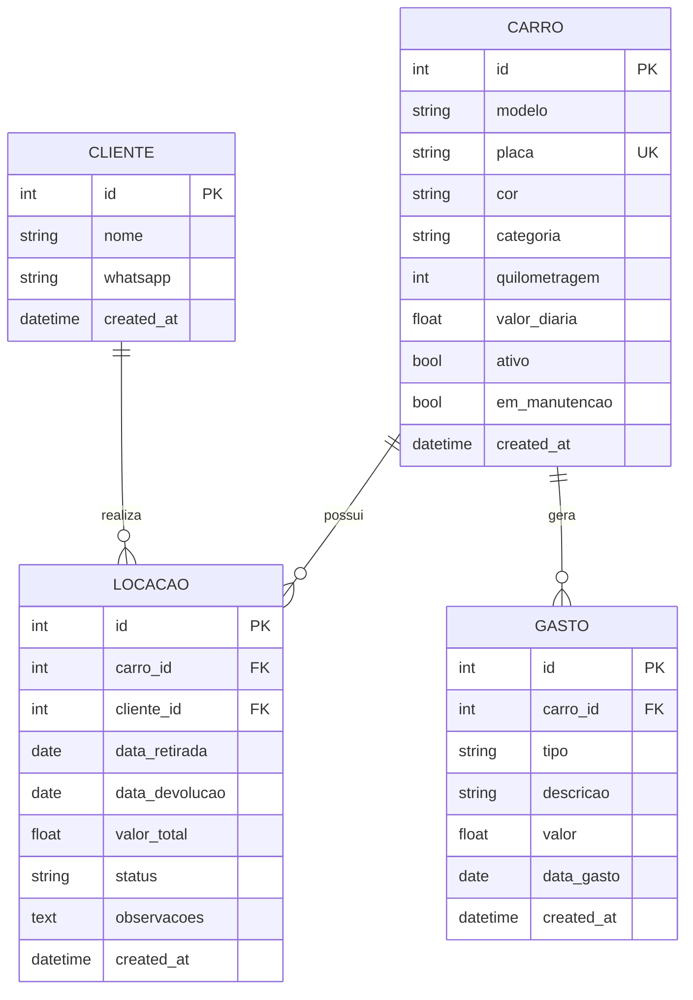

<div align="center">

# 🚗 Locamil Pro

### SaaS de Gestão de Frota Premium

[](https://www.python.org/)
[](https://flask.palletsprojects.com/)
[](https://www.sqlalchemy.org/)
[](https://getbootstrap.com/)
[](https://www.chartjs.org/)
[](LICENSE)
[](CONTRIBUTING.md)

**Aplicação web completa para gestão operacional e financeira de locadoras de veículos,
com dashboard interativo, KPIs financeiros em tempo real, gráficos Chart.js,
design dark mode premium com Glassmorphism e integração nativa com WhatsApp.**

[Começar Agora](#-início-rápido) · [Funcionalidades](#-funcionalidades) · [Arquitetura](#-arquitetura) · [Deploy](#-deploy) · [Contribuir](CONTRIBUTING.md)

</div>

---

## 📑 Índice

- [Visão Geral](#-visão-geral)
- [Stack Tecnológica](#-stack-tecnológica)
- [Arquitetura](#-arquitetura)
- [Modelo de Dados](#-modelo-de-dados)
- [Funcionalidades](#-funcionalidades)
- [Design & UI/UX](#-design--uiux)
- [Início Rápido](#-início-rápido)
- [Variáveis de Ambiente](#-variáveis-de-ambiente)
- [Estrutura do Projeto](#-estrutura-do-projeto)
- [Endpoints & Rotas](#-endpoints--rotas)
- [Lógica de Negócio](#-lógica-de-negócio)
- [Frota Seed](#-frota-seed)
- [Exportação de Dados](#-exportação-de-dados)
- [Segurança](#-segurança)
- [Deploy em Produção](#-deploy)
- [Roadmap](#-roadmap)
- [Contribuindo](#-contribuindo)
- [Licença](#-licença)

---

## 🎯 Visão Geral

O **Locamil Pro** é um sistema SaaS de gestão de frotas para locadoras de veículos, projetado para oferecer controle completo de operações e finanças em uma interface moderna e responsiva. O sistema combina:

- **Gestão operacional** — controle de disponibilidade, manutenções e locações com validação de conflitos de datas em tempo real.
- **Gestão financeira** — dashboard com KPIs (faturamento bruto, despesas operacionais, lucro líquido) e visualização de faturamento mensal nos últimos 6 meses.
- **Comunicação com o cliente** — envio de comprovantes de locação via WhatsApp Web com mensagem pré-formatada.
- **Exportação de dados** — backup e análise em formatos SQL, CSV e JSON.

> O sistema foi originalmente baseado em uma aplicação Streamlit (`rent_app.py`) e evoluiu para uma aplicação Flask completa com design premium, servindo como referência de portfólio profissional.

---

## 🛠 Stack Tecnológica

| Camada | Tecnologia | Versão | Finalidade |
|:---|:---|:---|:---|
| **Runtime** | Python | 3.8+ | Linguagem principal |
| **Framework Web** | Flask | 3.0.0 | Roteamento, templates, servidor |
| **ORM** | Flask-SQLAlchemy | 3.1.1 | Mapeamento objeto-relacional |
| **HTTP Server** | Werkzeug | 3.0.1 | Servidor WSGI de desenvolvimento |
| **Ambiente** | python-dotenv | 1.0.0 | Carregamento de variáveis `.env` |
| **Banco de Dados** | SQLite | Embutido | Persistência padrão (dev) |
| **UI Framework** | Bootstrap | 5.3.2 | Grid, componentes, responsividade |
| **Ícones** | Bootstrap Icons | 1.11.1 | Iconografia do sistema |
| **Gráficos** | Chart.js | 4.4.0 | Visualizações interativas |
| **Tipografia** | Google Fonts (Inter) | — | Fonte profissional |
| **Templating** | Jinja2 | Integrado Flask | Renderização server-side |

---

## 🏗 Arquitetura

O Locamil Pro segue uma arquitetura **MVC (Model-View-Controller)** simplificada:

```
┌──────────────────────────────────────────────────────────┐
│                      CLIENTE (Browser)                   │
│   Bootstrap 5 · Chart.js · Bootstrap Icons · Inter Font  │
└───────────────────────────┬──────────────────────────────┘
                            │ HTTP (GET/POST/AJAX)
                            ▼
┌──────────────────────────────────────────────────────────┐
│                  FLASK (Controlador)                     │
│                       app.py                             │
│                                                          │
│  ┌──────────────┐  ┌──────────────┐  ┌───────────────┐  │
│  │   Dashboard   │  │  Nova Locação│  │   Histórico   │  │
│  │  GET /        │  │ GET/POST     │  │  GET /hist.   │  │
│  └──────────────┘  └──────────────┘  └───────────────┘  │
│  ┌──────────────┐  ┌──────────────┐  ┌───────────────┐  │
│  │  Exportação  │  │   WhatsApp   │  │  Calc. AJAX   │  │
│  │ GET /exp/*   │  │ GET /wa/{id} │  │ POST /calc    │  │
│  └──────────────┘  └──────────────┘  └───────────────┘  │
└───────────────────────────┬──────────────────────────────┘
                            │ SQLAlchemy ORM
                            ▼
┌──────────────────────────────────────────────────────────┐
│                  MODELOS (models.py)                      │
│                                                          │
│  ┌──────┐  ┌─────────┐  ┌──────────┐  ┌──────────┐     │
│  │ Carro│  │ Cliente │  │ Locação  │  │  Gasto   │     │
│  └──┬───┘  └────┬────┘  └────┬─────┘  └────┬─────┘     │
│     │           │            │              │           │
│     └───────────┴────────────┴──────────────┘           │
│                          │                               │
└──────────────────────────┼───────────────────────────────┘
                           ▼
┌──────────────────────────────────────────────────────────┐
│              SQLite (instance/locadora.db)                │
│         (Substituível por PostgreSQL / MySQL)             │
└──────────────────────────────────────────────────────────┘
```

### Fluxo de Request

1. O browser envia uma requisição HTTP para uma rota Flask.
2. O controlador (`app.py`) processa a lógica de negócio (validações, cálculos financeiros, queries).
3. Os modelos (`models.py`) interagem com o banco via SQLAlchemy.
4. O template Jinja2 é renderizado com os dados e retornado como HTML.
5. Chart.js e Bootstrap executam no client-side para interatividade.

---

## 💾 Modelo de Dados

### Diagrama Entidade-Relacionamento



### Detalhamento das Entidades

#### `Carro` — Veículo da Frota

| Campo | Tipo | Restrição | Descrição |
|:---|:---|:---|:---|
| `id` | `Integer` | PK, auto-increment | Identificador único |
| `modelo` | `String(50)` | NOT NULL | Nome do modelo (ex: "Hyundai HB20") |
| `placa` | `String(10)` | UNIQUE, NOT NULL | Placa do veículo |
| `cor` | `String(20)` | Nullable | Cor do veículo |
| `categoria` | `String(30)` | NOT NULL, default="Econômico" | Econômico · Conforto · SUV · Premium |
| `quilometragem` | `Integer` | default=0 | Quilometragem acumulada |
| `valor_diaria` | `Float` | NOT NULL | Valor da diária em R$ |
| `ativo` | `Boolean` | default=True | Veículo ativo na frota |
| `em_manutencao` | `Boolean` | default=False | Bloqueia locações quando `True` |
| `created_at` | `DateTime` | default=utcnow | Data de cadastro |

#### `Cliente` — Cliente da Locadora

| Campo | Tipo | Restrição | Descrição |
|:---|:---|:---|:---|
| `id` | `Integer` | PK | Identificador único |
| `nome` | `String(100)` | NOT NULL | Nome completo |
| `whatsapp` | `String(20)` | Nullable | Número com prefixo +55 (formatado automaticamente) |
| `created_at` | `DateTime` | default=utcnow | Data de cadastro |

#### `Locacao` — Registro de Locação

| Campo | Tipo | Restrição | Descrição |
|:---|:---|:---|:---|
| `id` | `Integer` | PK | Identificador único |
| `carro_id` | `Integer` | FK → carros.id, NOT NULL | Veículo locado |
| `cliente_id` | `Integer` | FK → clientes.id, NOT NULL | Cliente locatário |
| `data_retirada` | `Date` | NOT NULL | Início da locação |
| `data_devolucao` | `Date` | NOT NULL | Fim previsto da locação |
| `valor_total` | `Float` | NOT NULL | Calculado: `dias × valor_diaria` |
| `status` | `String(20)` | default="ativa" | `ativa` · `finalizada` · `cancelada` |
| `observacoes` | `Text` | Nullable | Notas adicionais |
| `created_at` | `DateTime` | default=utcnow | Data de criação do registro |

#### `Gasto` — Despesa Operacional

| Campo | Tipo | Restrição | Descrição |
|:---|:---|:---|:---|
| `id` | `Integer` | PK | Identificador único |
| `carro_id` | `Integer` | FK → carros.id, NOT NULL | Veículo associado |
| `tipo` | `String(30)` | NOT NULL | Manutenção · Seguro · Lavagem · Combustível · IPVA · Outros |
| `descricao` | `String(200)` | Nullable | Detalhe do gasto |
| `valor` | `Float` | NOT NULL | Valor em R$ |
| `data_gasto` | `Date` | NOT NULL | Data da despesa |
| `created_at` | `DateTime` | default=utcnow | Data de registro |

### Relacionamentos

| Relação | Tipo | Cascata |
|:---|:---|:---|
| `Carro → Locacao` | 1:N | `all, delete-orphan` |
| `Carro → Gasto` | 1:N | `all, delete-orphan` |
| `Cliente → Locacao` | 1:N | — |

---

## ✨ Funcionalidades

### 📊 Dashboard Interativo

- **3 KPI Cards financeiros** — Faturamento (6 meses), Despesas (6 meses), Lucro Líquido
- **Gráfico de Linha** — Evolução do faturamento mensal (últimos 6 meses) com Chart.js
- **Gráfico de Rosca** — Distribuição em tempo real do status da frota (Disponível / Alugado / Manutenção)
- **Cards de status** — Status individual de cada veículo com categoria, diária, quilometragem e cliente atual
- **Tabelas de agenda** — Próximas devoluções e retiradas nos próximos 7 dias

### 📝 Nova Locação

- Formulário premium com seleção de cliente e veículo
- Campo de WhatsApp com formatação automática (`+55` prefix)
- Cálculo de valor total em tempo real via endpoint AJAX (`/calcular_valor`)
- Validação de conflitos de data (sobreposição) e status de manutenção
- Criação automática de cliente se não existente (upsert por nome)

### 📋 Histórico de Locações

- Listagem completa com ordenação por data (mais recentes primeiro)
- Filtro visual por status: **Ativa** / **Finalizada** / **Cancelada**
- Ações rápidas: Finalizar ou Cancelar locações ativas
- Envio de comprovante via WhatsApp Web com mensagem pré-formatada

### 📱 Integração WhatsApp

- Geração automática de link `wa.me` com comprovante formatado
- Mensagem inclui: veículo, datas, período, valor total
- Formatação inteligente do número (remove caracteres, adiciona `+55`)

### 📤 Exportação de Dados

| Formato | Conteúdo | Uso Principal |
|:---|:---|:---|
| **SQL** | INSERT statements de todas as tabelas | Backup e migração de banco |
| **CSV** | Locações com detalhes completos (BOM UTF-8) | Análise no Excel / Google Sheets |
| **JSON** | Dados estruturados (carros, clientes, locações) | Integração via API / análise programática |

### 🔧 Controle de Manutenção

- Flag `em_manutencao` no modelo `Carro`
- Veículos em manutenção são automaticamente bloqueados para locação
- Badge visual amarelo "Manutenção" no dashboard
- Borda amarela no card do veículo em manutenção

---

## 🎨 Design & UI/UX

### Dark Mode Premium

O sistema implementa um design dark mode sofisticado com paleta de cores cuidadosamente selecionada:

| Elemento | Cor | Hex |
|:---|:---|:---|
| Background Principal | Gradiente escuro profundo | `#0a0e27 → #1a1f3a` |
| Cards | Dark com blur | `rgba(21, 25, 50, 0.6)` |
| Acento Primário | Roxo Neon | `#a855f7` |
| Acento Secundário | Verde Esmeralda | `#10b981` |
| Texto Primário | Branco suave | `#f9fafb` |
| Texto Secundário | Cinza médio | `#9ca3af` |
| Status: Disponível | Verde | `#10b981` |
| Status: Alugado | Vermelho | `#ef4444` |
| Status: Manutenção | Amarelo | `#fbbf24` |

### Efeitos Visuais

- **Glassmorphism** — `backdrop-filter: blur(20px)` em todos os cards com bordas semitransparentes
- **Hover Lift** — Cards sobem 4px com sombra neon roxo ao passar o mouse
- **Gradientes** — Botões, sidebar brand e indicador de página ativa com gradientes `purple → green`
- **Scrollbar customizada** — Scrollbar roxa que combina com o tema
- **Indicador de aba ativa** — Barra gradiente vertical de 4px na sidebar

### Sidebar Lateral Fixa

- Largura: 280px em desktop
- Navegação com ícones Bootstrap Icons
- Colapsa em mobile (< 768px) com botão toggle
- Background com `backdrop-filter: blur(20px)`

### Responsividade

| Breakpoint | Comportamento |
|:---|:---|
| **Desktop** (≥ 768px) | Sidebar fixa 280px, conteúdo ao lado |
| **Mobile** (< 768px) | Sidebar colapsável, botão flutuante roxo, layout em coluna única |

### Tipografia

- **Fonte**: Inter (Google Fonts) com pesos 300-800
- **Fallback**: `-apple-system, BlinkMacSystemFont, 'Segoe UI', sans-serif`

---

## 🚀 Início Rápido

### Pré-requisitos

- [Python 3.8+](https://www.python.org/downloads/)
- pip (gerenciador de pacotes Python)
- Git (opcional)

### 1. Clonar o Repositório

```bash
git clone https://github.com/ghmata/Locamil.git
cd Locamil
```

### 2. Criar Ambiente Virtual (Recomendado)

```bash
# Linux/macOS
python -m venv venv
source venv/bin/activate

# Windows (PowerShell)
python -m venv venv
.\venv\Scripts\Activate.ps1
```

### 3. Instalar Dependências

```bash
pip install -r requirements.txt
```

### 4. Configurar Variáveis de Ambiente

```bash
# Linux/macOS
cp .env.example .env

# Windows (PowerShell)
Copy-Item .env.example .env
```

Edite o arquivo `.env` e configure:

```env
SECRET_KEY=<sua-chave-secreta-forte>
DATABASE_URI=sqlite:///locadora.db
FLASK_DEBUG=True
FLASK_HOST=0.0.0.0
FLASK_PORT=5000
```

> 💡 Para gerar uma `SECRET_KEY` segura:
> ```python
> python -c "import secrets; print(secrets.token_hex(32))"
> ```

### 5. Executar a Aplicação

```bash
python app.py
```

### 6. Acessar no Browser

```
http://localhost:5000
```

> Na primeira execução, o sistema automaticamente cria o banco de dados SQLite (`instance/locadora.db`), cadastra uma frota de **9 veículos** em 4 categorias e insere **13 gastos operacionais** de exemplo distribuídos nos últimos 6 meses.

---

## 🔐 Variáveis de Ambiente

| Variável | Obrigatória | Default | Descrição |
|:---|:---:|:---|:---|
| `SECRET_KEY` | ✅ | `dev-key-change-in-production` | Chave criptográfica para sessions Flask. **Deve ser alterada em produção.** |
| `DATABASE_URI` | ❌ | `sqlite:///locadora.db` | URI do banco. Suporta SQLite, PostgreSQL (`postgresql://...`), MySQL (`mysql://...`) |
| `FLASK_DEBUG` | ❌ | `True` | Modo debug. **Definir `False` em produção.** |
| `FLASK_HOST` | ❌ | `0.0.0.0` | Host do servidor |
| `FLASK_PORT` | ❌ | `5000` | Porta do servidor |

> ⚠️ Em produção, se `FLASK_DEBUG=False` e a `SECRET_KEY` for a padrão, a aplicação lança um `ValueError` de segurança e recusa iniciar.

---

## 📁 Estrutura do Projeto

```
Locamil/
│
├── .github/                          # Templates GitHub
│   ├── ISSUE_TEMPLATE/
│   │   ├── bug_report.md            # Template para reportar bugs
│   │   └── feature_request.md       # Template para solicitar features
│   └── pull_request_template.md     # Template para pull requests
│
├── instance/                         # Diretório Flask (auto-gerado)
│   └── locadora.db                  # Banco de dados SQLite
│
├── templates/                        # Templates Jinja2
│   ├── base.html                    # Layout base (sidebar, dark mode, CDNs)
│   ├── dashboard.html               # Dashboard com KPIs e gráficos Chart.js
│   ├── nova_locacao.html            # Formulário de nova locação com AJAX
│   ├── historico.html               # Listagem e gestão de locações
│   └── exportar.html               # Página de exportação (SQL/CSV/JSON)
│
├── app.py                            # Controlador Flask (791 linhas)
│   ├── seed_database()              # Seed de frota e gastos
│   ├── verificar_disponibilidade()  # Validação de conflitos
│   ├── formatar_telefone()          # Formatação +55 WhatsApp
│   ├── calcular_valor_total()       # Cálculo dias × diária
│   ├── get_status_carro_hoje()      # Status em tempo real
│   └── Rotas (/, /nova_locacao, /historico, /exportar, /whatsapp, etc.)
│
├── models.py                         # Modelos SQLAlchemy (136 linhas)
│   ├── Carro                        # Entidade veículo
│   ├── Cliente                      # Entidade cliente
│   ├── Locacao                      # Entidade locação
│   └── Gasto                        # Entidade despesa
│
├── rent_app.py                       # ⚠️ Legado: App Streamlit original
├── alugueis.json                     # ⚠️ Legado: Dados antigos (vazio)
│
├── .env.example                      # Template variáveis de ambiente
├── .gitignore                        # Arquivos ignorados pelo Git
├── .gitattributes                    # Normalização line-endings
├── requirements.txt                  # Dependências Python
│
├── CONTRIBUTING.md                   # Guia de contribuição
├── DEPLOY.md                         # Guia de deploy (multi-plataforma)
├── GITHUB_SETUP.md                   # Instruções de setup GitHub
├── PROJECT_STRUCTURE.md              # Documentação de estrutura
├── GUIA_SCREENSHOTS.md               # Guia para screenshots de portfólio
├── LOCAMIL_PRO_DOCUMENTACAO.md       # Documentação interna de desenvolvimento
├── PREPARADO_PARA_GITHUB.md          # Checklist de publicação
├── LICENSE                           # Licença MIT
└── README.md                         # ← Você está aqui
```

---

## 🌐 Endpoints & Rotas

### Páginas (Server-Side Rendered)

| Método | Rota | Função | Descrição |
|:---:|:---|:---|:---|
| `GET` | `/` | `index()` | Dashboard principal com KPIs, gráficos e status da frota |
| `GET` | `/nova_locacao` | `nova_locacao()` | Formulário de nova locação |
| `POST` | `/nova_locacao` | `nova_locacao()` | Processa criação de locação |
| `GET` | `/historico` | `historico()` | Lista todas as locações |
| `GET` | `/exportar` | `exportar()` | Página de exportação de dados |
| `GET` | `/whatsapp/<id>` | `enviar_comprovante_whatsapp()` | Redireciona para WhatsApp Web |

### Ações (POST)

| Método | Rota | Função | Descrição |
|:---:|:---|:---|:---|
| `POST` | `/finalizar_locacao/<id>` | `finalizar_locacao()` | Marca locação como "finalizada" |
| `POST` | `/cancelar_locacao/<id>` | `cancelar_locacao()` | Marca locação como "cancelada" |

### API (JSON)

| Método | Rota | Função | Descrição |
|:---:|:---|:---|:---|
| `POST` | `/calcular_valor` | `calcular_valor()` | Calcula valor total via AJAX (retorna JSON) |

### Exportação (Download)

| Método | Rota | Content-Type | Descrição |
|:---:|:---|:---|:---|
| `GET` | `/exportar/sql` | `text/sql` | Download de INSERT statements |
| `GET` | `/exportar/csv` | `text/csv` | Download CSV (BOM UTF-8 para Excel) |
| `GET` | `/exportar/json` | `application/json` | Download JSON estruturado |

---

## 🧠 Lógica de Negócio

### Verificação de Disponibilidade

A função `verificar_disponibilidade()` implementa uma validação de sobreposição de datas em 3 cenários:

```
Cenário 1: Nova locação COMEÇA durante uma existente
  Existente:  |==========|
  Nova:            |==========|

Cenário 2: Nova locação TERMINA durante uma existente
  Existente:       |==========|
  Nova:       |==========|

Cenário 3: Nova locação ENGLOBA uma existente
  Existente:    |====|
  Nova:       |==========|
```

Além disso, antes de verificar datas, o sistema confere se o veículo está em manutenção (`em_manutencao = True`), bloqueando a locação imediatamente.

### Cálculo de Valor

```
valor_total = (data_devolução - data_retirada + 1 dia) × valor_diária
```

O "+1" garante que locações de mesmo dia (retirada = devolução) contabilizem como 1 diária.

### Formatação de Telefone

O `formatar_telefone()` normaliza qualquer formato de entrada:

| Entrada | Saída |
|:---|:---|
| `11987654321` | `+5511987654321` |
| `(11) 98765-4321` | `+5511987654321` |
| `+5511987654321` | `+5511987654321` |
| `011987654321` | `+5511987654321` |
| `5511987654321` | `+5511987654321` |

### Dashboard Financeiro

Os KPIs são calculados em tempo real a cada requisição:

1. **Faturamento** — Soma de `valor_total` de todas as locações (status `ativa` ou `finalizada`) dos últimos 6 meses, agrupadas por mês.
2. **Despesas** — Soma de `valor` da tabela `Gasto` nos últimos 180 dias.
3. **Lucro Líquido** — `Faturamento - Despesas`.

---

## 🚙 Frota Seed

Na primeira execução, o sistema popula automaticamente a frota com **9 veículos** distribuídos em **4 categorias**:

### Econômico (R$ 75–80/dia)

| Modelo | Placa | Cor | KM |
|:---|:---|:---|---:|
| Renault Kwid | KWD-1010 | Branco | 45.000 |
| Fiat Mobi | MOB-2020 | Prata | 38.000 |

### Conforto (R$ 115–130/dia)

| Modelo | Placa | Cor | KM |
|:---|:---|:---|---:|
| Hyundai HB20 | HB-3030 | Branco | 52.000 |
| Chevrolet Onix | ONX-4040 | Preto | 48.000 |
| VW Polo | POL-5050 | Prata | 35.000 |

### SUV (R$ 175–180/dia)

| Modelo | Placa | Cor | KM |
|:---|:---|:---|---:|
| VW T-Cross | TCR-6060 | Cinza | 28.000 |
| Chevrolet Tracker | TRK-7070 | Branco | 31.000 |

### Premium (R$ 350–380/dia)

| Modelo | Placa | Cor | KM |
|:---|:---|:---|---:|
| BMW 320i | BMW-8080 | Preto | 18.000 |
| Mercedes C180 | MER-9090 | Prata | 15.000 |

Também são inseridos **13 gastos operacionais** de exemplo (Manutenção, Seguro, Lavagem, IPVA) distribuídos nos últimos 6 meses para popular os gráficos financeiros.

---

## 📤 Exportação de Dados

### SQL Export

Gera arquivo `.sql` com INSERT statements para todas as tabelas. Útil para:
- Backup completo do banco de dados
- Migração entre ambientes (dev → staging → prod)
- Importação em outro SGBD

### CSV Export

Gera arquivo `.csv` codificado em UTF-8 com BOM (compatível com Excel). Inclui:
- ID, Carro, Placa, Cliente, WhatsApp
- Datas de Retirada e Devolução
- Dias, Valor Diária, Valor Total, Status

### JSON Export

Gera arquivo `.json` estruturado e indentado com:
- Metadados da exportação (data, versão)
- Array de carros, clientes e locações
- Datas em formato ISO 8601

---

## 🔒 Segurança

### Medidas Implementadas

| Medida | Descrição |
|:---|:---|
| **SECRET_KEY obrigatória** | Validação em produção: rejeita chave padrão quando `FLASK_DEBUG=False` |
| **Variáveis de ambiente** | Todas as configurações sensíveis carregadas via `.env` (nunca commitado) |
| **CSRF via Flask** | Sessions assinadas com SECRET_KEY |
| **Validação de entrada** | Sanitização de nomes, datas e números de telefone |
| **SQL Injection Prevention** | SQLAlchemy ORM parameteriza todas as queries |

### Checklist de Segurança para Produção

- [ ] `FLASK_DEBUG=False` configurado
- [ ] `SECRET_KEY` forte e única (64+ chars hex)
- [ ] `.env` não commitado no Git (verificar `.gitignore`)
- [ ] Banco de dados de produção configurado (PostgreSQL recomendado)
- [ ] Servidor WSGI (Gunicorn) ao invés do servidor de desenvolvimento
- [ ] HTTPS/SSL habilitado
- [ ] Backup periódico do banco de dados

---

## 🚀 Deploy

O sistema pode ser implantado em diversas plataformas. Consulte o **[guia completo de deploy](DEPLOY.md)** com instruções detalhadas para:

| Plataforma | Dificuldade | Custo | Destaque |
|:---|:---:|:---|:---|
| **PythonAnywhere** | ⭐ | Gratuito | Recomendado para iniciantes |
| **Railway** | ⭐⭐ | Freemium | Deploy automático via GitHub |
| **Render** | ⭐⭐ | Gratuito | SSL automático |
| **Heroku** | ⭐⭐ | Pago | Ecossistema maduro |
| **DigitalOcean** | ⭐⭐⭐ | $5/mês+ | Máximo controle |

### Deploy Rápido (Railway)

```bash
# 1. Push para GitHub
git push origin main

# 2. Acessar railway.app → New Project → Deploy from GitHub
# 3. Configurar variáveis de ambiente no painel
# 4. Deploy automático ✅
```

### Produção com Gunicorn

```bash
pip install gunicorn
gunicorn app:app --bind 0.0.0.0:8000 --workers 4
```

---

## 🗺 Roadmap

- [x] Dashboard com KPIs financeiros
- [x] Gráficos interativos (Chart.js)
- [x] Dark mode premium com Glassmorphism
- [x] Integração WhatsApp
- [x] Exportação multi-formato (SQL/CSV/JSON)
- [x] Controle de manutenção
- [x] Categorias de veículos (Econômico → Premium)
- [ ] Sistema de autenticação de usuários (login/registro)
- [ ] Relatórios avançados com filtros por período
- [ ] Integração com gateway de pagamento
- [ ] Notificações por e-mail/SMS (devoluções próximas)
- [ ] API RESTful completa
- [ ] App mobile (React Native / Flutter)
- [ ] Gestão de multas e sinistros
- [ ] Multi-tenancy (múltiplas locadoras)

---

## 🤝 Contribuindo

Contribuições são muito bem-vindas! Leia o **[guia de contribuição](CONTRIBUTING.md)** completo para detalhes.

### Resumo Rápido

```bash
# 1. Fork este repositório
# 2. Crie uma branch para sua feature
git checkout -b feature/minha-feature

# 3. Faça suas alterações e commit
git commit -m "feat: adiciona minha feature"

# 4. Push para seu fork
git push origin feature/minha-feature

# 5. Abra um Pull Request
```

### Convenção de Commits

| Prefixo | Uso |
|:---|:---|
| `feat:` | Nova funcionalidade |
| `fix:` | Correção de bug |
| `docs:` | Documentação |
| `style:` | Formatação / CSS |
| `refactor:` | Refatoração |
| `test:` | Testes |
| `chore:` | Manutenção |

---

## 📞 Suporte

Encontrou um problema? Verifique:

1. Se todas as dependências foram instaladas (`pip install -r requirements.txt`)
2. Se a porta 5000 está disponível
3. Se o arquivo `.env` está configurado corretamente
4. Se há permissões para criar o diretório `instance/`

Caso persista, [abra uma issue](https://github.com/ghmata/Locamil/issues) com:
- Descrição do problema
- Passos para reproduzir
- Logs de erro (se houver)
- Versão do Python e sistema operacional

---

## 📄 Licença

Este projeto está licenciado sob a **[Licença MIT](LICENSE)**.

```
MIT License — Copyright (c) 2025 Locamil - Sistema de Gestão de Locadora
```

---

<div align="center">

**Desenvolvido por [Gabriel Mata](https://github.com/ghmata)**

Feito com ❤️ para facilitar a gestão de locadoras de veículos.

⭐ Se este projeto foi útil, considere dar uma estrela!

</div>
