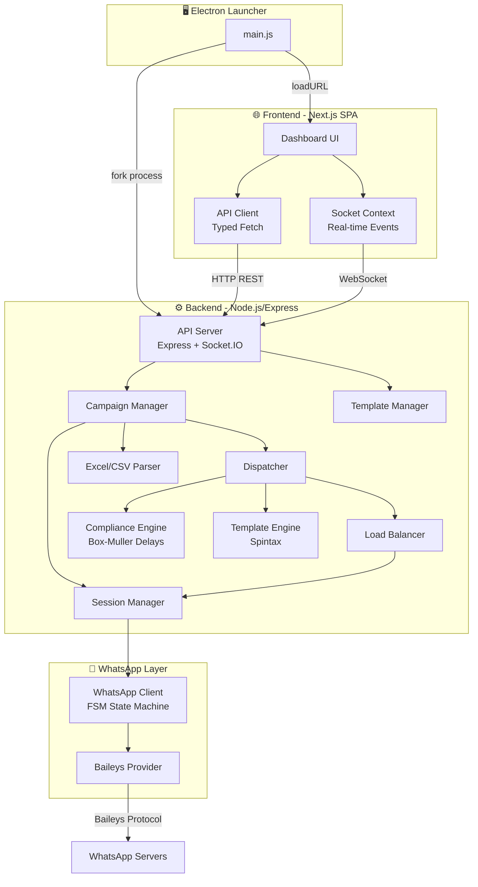
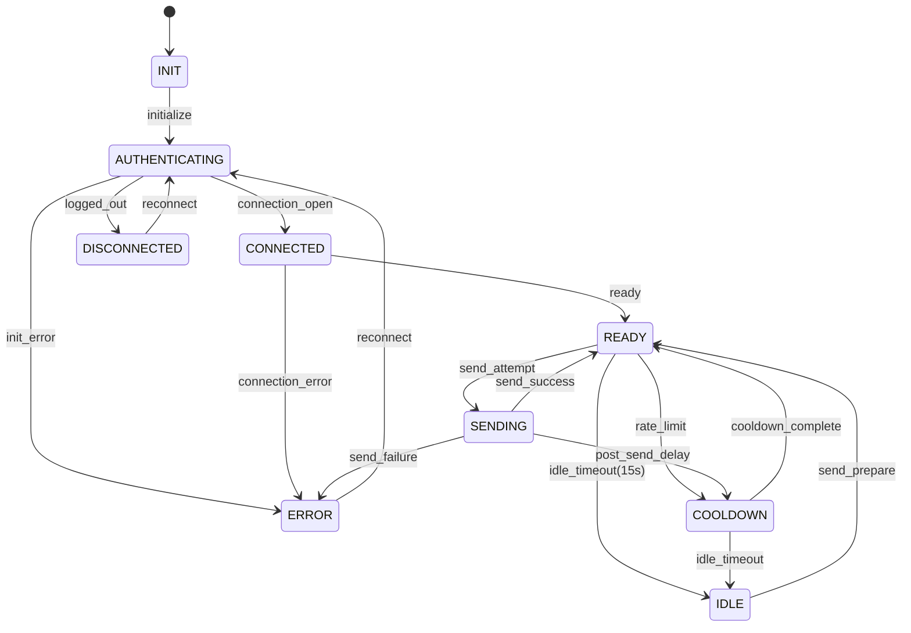

# 📡 Smart Dispatcher


> **Sistema desktop profissional de automação de WhatsApp** com dashboard em tempo real, gerenciamento multi-chip, campanhas em massa com proteção anti-ban e interface moderna — empacotado como aplicação Electron portátil para Windows.

---

## 📋 Índice

- [🎯 Sobre o Projeto](#-sobre-o-projeto)
- [📸 Screenshots / Demo](#-screenshots--demo)
- [✨ Funcionalidades](#-funcionalidades)
- [🏗️ Arquitetura](#️-arquitetura)
- [🛠️ Stack Tecnológica](#️-stack-tecnológica)
- [📦 Pré-requisitos](#-pré-requisitos)
- [🚀 Instalação e Configuração](#-instalação-e-configuração)
- [⚙️ Variáveis de Ambiente](#️-variáveis-de-ambiente)
- [🖥️ Como Usar](#️-como-usar)
- [📡 API Reference](#-api-reference)
- [🧪 Testes](#-testes)
- [📁 Estrutura do Projeto](#-estrutura-do-projeto)
- [🚢 Deploy / Build](#-deploy--build)
- [🔒 Segurança](#-segurança)
- [📝 Decisões Arquiteturais (ADR)](#-decisões-arquiteturais-adr)
- [📄 Licença](#-licença)
- [👤 Autor / Contato](#-autor--contato)

---

## 🎯 Sobre o Projeto

O **Smart Dispatcher** é uma aplicação desktop completa para automação de envio de mensagens via WhatsApp, projetada para equipes de marketing e vendas que precisam realizar disparos em massa de forma **segura, organizada e inteligente**.

### Problema que Resolve

Envio manual de mensagens pelo WhatsApp é lento, repetitivo e propenso a erros. Ferramentas web comuns são instáveis e frequentemente resultam em banimentos. O Smart Dispatcher resolve isso oferecendo:

- **Automação inteligente** com múltiplos chips WhatsApp simultâneos
- **Proteção anti-ban** com delays humanizados (distribuição normal Box-Muller)
- **Dashboard em tempo real** com métricas, gráficos e logs ao vivo
- **Portabilidade total** — roda de qualquer pasta/pendrive sem instalação

### Público-Alvo

- Equipes de **marketing digital** e **vendas**
- **Pequenas e médias empresas** que precisam disparar campanhas via WhatsApp
- **Agências** que gerenciam múltiplas contas WhatsApp para clientes

---

## 📸 Screenshots / Demo

<!-- TODO: Adicionar capturas de tela do Dashboard, página de Campanhas, Conexões e Configurações -->

```
┌─────────────────────────────────────────────────────────────┐
│  📊 Dashboard           │  Mensagens Hoje: 247              │
│  ─────────────────────  │  Taxa de Entrega: 98%             │
│  📈 Gráfico por Hora    │  Campanhas Ativas: 1              │
│  ████████░░░░░░░░░░░░   │  Fila: 180/500                    │
│                          │                                    │
│  📋 Terminal de Logs     │  ✅ Mensagem enviada para (11)... │
│  ────────────────────── │  ⏳ Aguardando cooldown...         │
│  > Sistema Funcionando   │  ✅ Mensagem enviada para (21)... │
└─────────────────────────────────────────────────────────────┘
```

---

## ✨ Funcionalidades

### 📱 Gerenciamento de Conexões WhatsApp
- [x] Multi-chip — conecte múltiplos números WhatsApp simultaneamente
- [x] Autenticação via QR Code renderizado em tempo real na UI
- [x] Sessões persistentes com reconexão automática
- [x] Load balancing entre chips ativos (round-robin)
- [x] Auto-destruição de sessões com QR expirado (60s timeout)
- [x] Status visual por chip: `LOADING`, `QR`, `SYNCING`, `READY`, `ERROR`, `DISCONNECTED`

### 📤 Campanhas de Disparo em Massa
- [x] Upload de planilhas Excel (`.xlsx`) e CSV (`.csv`) com contatos
- [x] Motor de templates com variáveis dinâmicas (`{nome}`, `{empresa}`, etc.)
- [x] **Spintax recursivo** para variação de mensagens (`{Olá|Oi|Hey} {nome}!`)
- [x] Wizard de 4 etapas na UI: Upload → Mensagem → Configuração → Lançamento
- [x] Quick Templates — modelos de mensagem salvos e reutilizáveis
- [x] Restrição a uma campanha ativa por vez
- [x] Retomada automática de campanhas interrompidas (`Auto-Resume`)

### 🛡️ Motor de Compliance Anti-Ban
- [x] Delays com **distribuição normal (Box-Muller)** — simula comportamento humano
- [x] Simulação de tempo de digitação baseada no comprimento da mensagem
- [x] Rate limiting por chip: **50 msg/hora** e **300 msg/dia** (configurável)
- [x] Cooldown automático com jitter entre envios
- [x] Validação de número via `onWhatsApp()` antes do envio
- [x] Sanitização estrita de telefones (`^55\d{10,11}$`)
- [x] Reconexão controlada com limite máximo de tentativas

### 📊 Dashboard em Tempo Real
- [x] Métricas: mensagens enviadas, taxa de entrega, fila de processamento
- [x] Comparação com dia anterior (variação percentual)
- [x] Gráfico de envios por hora (24h) com Recharts
- [x] Terminal de logs ao vivo via WebSocket
- [x] Status de todas as conexões/chips em cards visuais

### ⚙️ Configurações
- [x] Delays mínimo e máximo configuráveis pela UI
- [x] Tema escuro nativo
- [x] Responsive para diferentes resoluções

### 🗃️ Persistência e Resiliência
- [x] Estado de campanha salvo em `campaign_state.json` a cada envio
- [x] Estatísticas diárias persistidas com histórico de 30 dias
- [x] Sessões WhatsApp salvas em disco com isolamento por chip
- [x] Crash-loop protection no Electron Launcher (5 retries/min)
- [x] Graceful shutdown com desconexão limpa de todas as sessões

---

## 🏗️ Arquitetura

O Smart Dispatcher segue uma **arquitetura monorepo** com três camadas separadas: **Backend** (API + Engine), **Frontend** (Dashboard SPA) e **Electron** (Launcher Desktop).

### Diagrama de Arquitetura



### Máquina de Estados do WhatsApp Client (FSM)



### Estrutura de Pastas (Visão Geral)

```
Smart-Dispatcher/
├── 📁 Backend/              # API + Motor de Disparo
│   ├── 📁 src/
│   │   ├── 📁 main/         # CLI Entry Point
│   │   ├── 📁 modules/      # Módulos de Negócio
│   │   │   ├── 📁 campaign/    # Gerenciamento de campanhas + Spintax
│   │   │   ├── 📁 compliance/  # Motor anti-ban (Box-Muller)
│   │   │   ├── 📁 dispatch/    # Dispatcher de mensagens
│   │   │   ├── 📁 parser/      # Parsers Excel/CSV
│   │   │   ├── 📁 utils/       # Logger, Paths, Phone, Templates
│   │   │   └── 📁 whatsapp/    # Client FSM, SessionManager, LoadBalancer
│   │   │       └── 📁 providers/  # BaileysProvider (abstração)
│   │   └── 📁 server/       # API Express + Socket.IO
│   ├── 📄 config.json        # Configurações de compliance e logging
│   └── 📄 package.json
├── 📁 Frontend/              # Dashboard UI (SPA)
│   ├── 📁 app/               # Next.js App Router
│   ├── 📁 components/        # Componentes React
│   │   ├── 📁 campaign/         # Wizard de campanhas (4 etapas)
│   │   ├── 📁 connections/      # Cards de chips WhatsApp
│   │   ├── 📁 dashboard/        # Métricas, Gráficos, Terminal
│   │   ├── 📁 ui/               # shadcn/ui (57+ componentes)
│   │   └── 📁 views/            # Páginas principais
│   ├── 📁 hooks/              # Custom Hooks (useToast, useMobile)
│   ├── 📁 lib/                # API Client, Socket Context, Utils
│   └── 📄 package.json
├── 📁 electron/               # Launcher Desktop
│   └── 📄 main.js            # Bootstrap: fork Backend → load Frontend
├── 📄 package.json            # Root: Scripts de build + Electron Builder
└── 📄 README.md
```

---

## 🛠️ Stack Tecnológica

### Backend

| Tecnologia | Versão | Propósito |
|---|---|---|
| **Node.js** | ≥ 18 | Runtime JavaScript |
| **Express** | 5.2 | Framework HTTP para API REST |
| **Socket.IO** | 4.8 | Comunicação WebSocket em tempo real |
| **@whiskeysockets/baileys** | 6.7 | Protocolo WhatsApp (socket nativo, sem Chromium) |
| **ExcelJS** | 4.4 | Parsing de planilhas `.xlsx` |
| **Multer** | 2.0 | Upload de arquivos (multipart/form-data) |
| **Winston** | 3.19 | Logger estruturado com rotação diária |
| **winston-daily-rotate-file** | 4.7 | Rotação automática de logs (7 dias) |
| **QRCode** | 1.5 | Geração de QR Code como Data URL |
| **qrcode-terminal** | 0.12 | QR Code no terminal (CLI) |
| **Pino** | 9.4 | Logger de alta performance (Baileys) |
| **CORS** | 2.8 | Middleware de Cross-Origin |

### Frontend

| Tecnologia | Versão | Propósito |
|---|---|---|
| **Next.js** | 16.0 | Framework React com App Router |
| **React** | 19.2 | Biblioteca de UI com Hooks |
| **TypeScript** | 5.x | Tipagem estática |
| **TailwindCSS** | 4.1 | Framework de estilos utilitários |
| **shadcn/ui** | — | 57+ componentes UI (Radix UI + Tailwind) |
| **Recharts** | 2.15 | Gráficos interativos (envios por hora) |
| **Socket.IO Client** | 4.8 | Comunicação em tempo real com Backend |
| **React Hook Form** | 7.60 | Gerenciamento de formulários |
| **Zod** | 3.25 | Validação de schemas |
| **Sonner** | 1.7 | Notificações toast |
| **Lucide React** | 0.454 | Biblioteca de ícones |
| **date-fns** | 4.1 | Manipulação de datas |
| **next-themes** | 0.4 | Suporte a temas (dark/light) |

### Desktop & Build

| Tecnologia | Versão | Propósito |
|---|---|---|
| **Electron** | 33.2 | Framework desktop (wrapper nativo) |
| **electron-builder** | 26.7 | Build e empacotamento para Windows |

### Dev Tools

| Tecnologia | Versão | Propósito |
|---|---|---|
| **ESLint** | 8.56 | Linter JavaScript/TypeScript |
| **Prettier** | 3.2 | Formatador de código |

---

## 📦 Pré-requisitos

| Requisito | Versão Mínima | Notas |
|---|---|---|
| **Node.js** | ≥ 18.0.0 | LTS recomendado |
| **npm** | ≥ 8 | Incluído com Node.js |
| **Windows** | 10+ | Otimizado para Windows (paths, file locks) |
| **WhatsApp** | Conta ativa | Necessário para escanear QR Code |

> [!IMPORTANT]
> O Smart Dispatcher foi projetado e otimizado para **Windows**. Embora o código Node.js seja cross-platform, features como gerenciamento de file locks e paths de sessão foram testados exclusivamente no ambiente Windows.

---

## 🚀 Instalação e Configuração

### 1. Clone o Repositório

```bash
git clone https://github.com/ghmata/Smart-Dispatcher.git
cd Smart-Dispatcher
```

### 2. Instale as Dependências

```bash
# Dependências do Electron Launcher (raiz)
npm install

# Dependências do Backend
cd Backend
npm install
cd ..

# Dependências do Frontend
cd Frontend
npm install
cd ..
```

### 3. Configure as Variáveis de Ambiente

```bash
# Frontend (apenas para modo de desenvolvimento separado)
cd Frontend
cp .env.example .env.local
# Edite .env.local se necessário (veja seção de Variáveis de Ambiente)
cd ..
```

### 4. Inicie em Modo de Desenvolvimento

<details>
<summary><strong>Opção A: Electron (Recomendado — Tudo integrado)</strong></summary>

```bash
# Na raiz do projeto
# 1. Faça o build do frontend (necessário uma vez)
npm run build-frontend

# 2. Inicie o Electron (Backend + Frontend)
npm start
```

O Electron vai:
1. Iniciar o Backend automaticamente em uma porta dinâmica
2. Abrir o Frontend embutido na janela do Electron

</details>

<details>
<summary><strong>Opção B: Backend + Frontend separados (Desenvolvimento)</strong></summary>

**Terminal 1 — Backend:**
```bash
cd Backend
npm run dev
# Roda em http://localhost:3001 com --watch (auto-reload)
```

**Terminal 2 — Frontend:**
```bash
cd Frontend
npm run dev
# Roda em http://localhost:3000
```

> Configure `NEXT_PUBLIC_API_BASE_URL=http://localhost:3001/api` no `Frontend/.env.local` para conectar ao Backend separado.

</details>

### 5. Crie as Pastas de Dados

```bash
# Certifique-se de que estas pastas existem
mkdir -p Backend/data/sessions
mkdir -p Backend/data/logs
mkdir -p Backend/uploads
```

---

## ⚙️ Variáveis de Ambiente

### Frontend (`Frontend/.env.local`)

| Variável | Obrigatória | Descrição | Exemplo |
|---|---|---|---|
| `NEXT_PUBLIC_API_BASE_URL` | ❌ Não | URL da API do Backend. **Não necessário** se rodando via Electron ou com Backend servindo o Frontend. Apenas para dev separado. | `http://localhost:3001/api` |

> [!NOTE]
> Em produção (Electron), o Frontend é servido como arquivos estáticos pelo próprio Backend, eliminando a necessidade de variáveis de ambiente. As chamadas usam caminhos relativos (`/api`).

### Backend (`Backend/config.json`)

O Backend utiliza um arquivo `config.json` em vez de variáveis de ambiente:

| Configuração | Valor Padrão | Descrição |
|---|---|---|
| `compliance.minDelay` | `30000` | Delay mínimo entre mensagens (ms) |
| `compliance.maxDelay` | `90000` | Delay máximo entre mensagens (ms) |
| `compliance.maxMessagesPerHour` | `50` | Limite de mensagens por hora por chip |
| `compliance.maxMessagesPerDay` | `300` | Limite de mensagens por dia por chip |
| `logging.level` | `"info"` | Nível de log: `debug`, `info`, `warn`, `error` |
| `logging.maxFiles` | `"7d"` | Retenção de arquivos de log |
| `logging.maxSize` | `"10m"` | Tamanho máximo por arquivo de log |
| `paths.sessions` | `"data/sessions"` | Diretório de sessões WhatsApp |
| `paths.logs` | `"data/logs"` | Diretório de logs |

```json
{
  "compliance": {
    "minDelay": 30000,
    "maxDelay": 90000,
    "maxMessagesPerHour": 50,
    "maxMessagesPerDay": 300
  },
  "logging": {
    "level": "info",
    "maxFiles": "7d",
    "maxSize": "10m"
  },
  "paths": {
    "sessions": "data/sessions",
    "logs": "data/logs"
  }
}
```

---

## 🖥️ Como Usar

### Comandos Disponíveis

#### Raiz (Electron)

| Comando | Descrição |
|---|---|
| `npm start` | Inicia o Electron (Backend + Frontend) |
| `npm run pack` | Build do Electron sem empacotamento |
| `npm run dist` | Build completo: Frontend → Backend → Electron portable |
| `npm run build-frontend` | Build de produção do Frontend (export estático) |
| `npm run install-frontend` | Instala dependências do Frontend |
| `npm run install-backend` | Instala dependências do Backend (produção) |

#### Backend

| Comando | Descrição |
|---|---|
| `npm start` | Inicia o servidor API |
| `npm run dev` | Inicia com `--watch` (auto-reload) |
| `npm run cli` | Inicia o modo CLI (sem API) |
| `npm run lint` | Executa o ESLint |

#### Frontend

| Comando | Descrição |
|---|---|
| `npm run dev` | Inicia o servidor de desenvolvimento Next.js |
| `npm run build` | Build de produção (static export em `/out`) |
| `npm run lint` | Executa o ESLint |
| `npm start` | Inicia o servidor Next.js em produção |

### Fluxo de Uso Típico

1. **Inicie** o aplicativo via Electron (`npm start`)
2. **Conecte** um ou mais chips WhatsApp:
   - Clique em "Novo Chip" na aba **Conexões**
   - Escaneie o QR Code com o WhatsApp do celular
   - Aguarde o status mudar para `READY` ✅
3. **Crie uma Campanha**:
   - Vá para a aba **Campanha**
   - **Etapa 1** — Faça upload de uma planilha (`.xlsx` ou `.csv`)
   - **Etapa 2** — Escreva a mensagem usando variáveis e Spintax
   - **Etapa 3** — Configure delays (intervalo entre mensagens)
   - **Etapa 4** — Revise e lance a campanha
4. **Monitore** em tempo real no **Dashboard**:
   - Acompanhe métricas, gráficos e logs ao vivo
   - Visualize o progresso da fila de envio

### Formato da Planilha de Contatos

A planilha deve conter no mínimo as colunas **Nome** e **Telefone**:

```csv
Nome;Telefone;Empresa;Observacao
"Silva, João";5511987654321;Empresa A;"Cliente importante"
"Santos, Maria";5511987654322;Empresa B;"Preferencial"
Pedro Oliveira;5511987654323;Empresa C;"Cliente novo"
```

> [!TIP]
> - Telefones devem incluir o código do país (`55`) + DDD + número
> - Colunas adicionais podem ser usadas como variáveis no template da mensagem
> - Formatos aceitos: `.xlsx` (Excel) e `.csv` (separado por `;` ou `,`)

### Spintax — Variação de Mensagens

O Spintax permite criar variações automáticas para cada mensagem enviada:

```
{Olá|Oi|Hey} {nome}! {Tudo bem|Como vai}?

Sobre a {empresa}, gostaria de {apresentar|mostrar} {nossos serviços|nosso trabalho}.

{Abraço|Att|Obrigado},
{Equipe|Time} SmartX
```

Cada envio gera uma combinação única, reduzindo o risco de detecção como spam.

---

## 📡 API Reference

O Backend expõe uma API REST + WebSocket. Todas as rotas REST estão sob o prefixo `/api`.

### Endpoints REST

#### Sistema

| Método | Rota | Descrição |
|---|---|---|
| `GET` | `/health` | Health check (usada pelo Electron launcher) |
| `GET` | `/api/status` | Status geral: campanhas ativas, envios, taxa de entrega, fila |
| `GET` | `/api/dashboard/hourly` | Dados de envios agrupados por hora (24h) |

#### Sessões WhatsApp (Chips)

| Método | Rota | Descrição |
|---|---|---|
| `GET` | `/api/sessions` | Lista todos os chips com status, nome, telefone, QR |
| `POST` | `/api/session/new` | Cria um novo chip (inicia autenticação) |
| `POST` | `/api/session/:id/connect` | Reconecta um chip existente |
| `DELETE` | `/api/session/:id` | Remove e desconecta um chip |

#### Campanhas

| Método | Rota | Descrição |
|---|---|---|
| `POST` | `/api/campaign/start` | Inicia uma campanha (multipart: arquivo + mensagem + delays) |

#### Templates

| Método | Rota | Descrição |
|---|---|---|
| `GET` | `/api/templates` | Lista todos os templates salvos |
| `POST` | `/api/templates` | Salva um novo template |
| `DELETE` | `/api/templates/:id` | Remove um template |

### Eventos WebSocket (Socket.IO)

| Evento | Direção | Payload | Descrição |
|---|---|---|---|
| `log` | Server → Client | `string` | Log do sistema em tempo real |
| `qr_code` | Server → Client | `{ chipId, qr, qrTimestamp }` | QR Code para autenticação |
| `session_change` | Server → Client | `{ chipId, status }` | Mudança de status de um chip |
| `session_deleted` | Server → Client | `{ chipId }` | Chip removido |
| `campaign_started` | Server → Client | `{ campaignId, totalContacts, remaining }` | Campanha iniciada |
| `campaign_finished` | Server → Client | `{ campaignId, processed, failed, failedContacts }` | Campanha finalizada |
| `message_status` | Server → Client | `{ campaignId, phone, status, error? }` | Status de envio de mensagem |
| `cooldown_wait` | Server → Client | `{ duration, min, max }` | Cooldown entre mensagens |
| `queue_update` | Server → Client | `{ current, total }` | Progresso da fila |

<details>
<summary><strong>Exemplo de Resposta — GET /api/status</strong></summary>

```json
{
  "active_campaigns": 1,
  "total_sent": 247,
  "delivery_rate": 98,
  "queue_current": 180,
  "queue_total": 500,
  "comparisons": {
    "total_sent": 23,
    "delivery_rate": 5,
    "connections": 0
  }
}
```

</details>

<details>
<summary><strong>Exemplo de Resposta — GET /api/sessions</strong></summary>

```json
[
  {
    "id": "chip_1710000000000",
    "status": "READY",
    "name": "João Silva",
    "phone": "5511999998888",
    "battery": 100,
    "displayOrder": 1,
    "qr": null,
    "qrTimestamp": null
  }
]
```

</details>

<details>
<summary><strong>Exemplo — POST /api/campaign/start</strong></summary>

```bash
curl -X POST http://localhost:3001/api/campaign/start \
  -F "file=@contatos.xlsx" \
  -F "message={Olá|Oi} {nome}! Tudo bem?" \
  -F "delayMin=30" \
  -F "delayMax=90"
```

```json
{
  "success": true,
  "message": "Campaign started in background",
  "campaignId": "cmp_1710000000000_abc123"
}
```

</details>

---

## 🧪 Testes

O projeto possui scripts de teste para validação de parsing de CSV:

```bash
# Teste de delimitação CSV
node test_csv_delimiter.js

# Teste de integração CSV
node teste_integracao_csv.js
```

> [!NOTE]
> Scripts de testes experimentais e anteriores foram movidos para a pasta `_quarantine/` durante a reorganização do projeto.

---

## 📁 Estrutura do Projeto

```
Smart-Dispatcher/
│
├── 📁 Backend/                          # ⚙️ Motor de Disparo + API
│   ├── 📁 src/
│   │   ├── 📁 main/
│   │   │   └── 📄 index.js              # Entry point CLI
│   │   ├── 📁 modules/
│   │   │   ├── 📁 campaign/
│   │   │   │   ├── 📄 campaignManager.js # Orquestra todo o fluxo de campanha
│   │   │   │   ├── 📄 spintax.js         # Parser de Spintax recursivo
│   │   │   │   └── 📄 templateEngine.js  # Motor de templates com variáveis
│   │   │   ├── 📁 compliance/
│   │   │   │   └── 📄 engine.js          # Box-Muller delays + typing simulation
│   │   │   ├── 📁 dispatch/
│   │   │   │   └── 📄 dispatcher.js      # Dispatcher com anti-ban completo
│   │   │   ├── 📁 parser/
│   │   │   │   ├── 📄 csvParser.js       # Parser CSV (multi-delimiter)
│   │   │   │   └── 📄 excelParser.js     # Parser Excel via ExcelJS
│   │   │   ├── 📁 utils/
│   │   │   │   ├── 📄 correlation.js     # IDs de rastreamento (campaign, message)
│   │   │   │   ├── 📄 fileLockHelper.js  # Helper para file locks (Windows)
│   │   │   │   ├── 📄 logger.js          # Winston logger com PII masking
│   │   │   │   ├── 📄 pathHelper.js      # Resolução de caminhos portáteis
│   │   │   │   ├── 📄 phone.js           # Sanitização e validação de telefones BR
│   │   │   │   └── 📄 templateManager.js # CRUD de templates (persistência em JSON)
│   │   │   └── 📁 whatsapp/
│   │   │       ├── 📄 loadBalancer.js     # Round-robin entre chips ativos
│   │   │       ├── 📄 sessionManager.js   # Gerenciamento de sessões (lifecycle)
│   │   │       ├── 📄 whatsappClient.js   # Client com FSM (9 estados)
│   │   │       └── 📁 providers/
│   │   │           ├── 📄 baileysProvider.js   # Implementação Baileys
│   │   │           └── 📄 whatsAppProvider.js  # Interface abstrata de provider
│   │   └── 📁 server/
│   │       └── 📄 api.js                 # Servidor Express + Socket.IO + Frontend
│   ├── 📁 scripts/
│   │   └── 📄 generate-template.js       # Script auxiliar de templates
│   ├── 📁 uploads/                       # Arquivos uploadados (temporário)
│   ├── 📄 config.json                    # Configurações de compliance e logging
│   ├── 📄 package.json                   # Dependências do Backend
│   ├── 📄 BAILEYS_MIGRATION.md           # Documentação de migração para Baileys
│   ├── 📄 DECISIONS.md                   # ADR — Decisões Arquiteturais
│   └── 📄 SECURITY_NOTES.md             # Notas de segurança
│
├── 📁 Frontend/                          # 🌐 Dashboard UI (SPA)
│   ├── 📁 app/
│   │   ├── 📄 globals.css               # Estilos globais + tema escuro
│   │   ├── 📄 layout.tsx                # Root layout (pt-BR, dark mode)
│   │   └── 📄 page.tsx                  # Página principal (single-page)
│   ├── 📁 components/
│   │   ├── 📁 campaign/
│   │   │   ├── 📄 step-upload.tsx        # Wizard: upload de planilha
│   │   │   ├── 📄 step-message.tsx       # Wizard: editor de mensagem
│   │   │   ├── 📄 step-config.tsx        # Wizard: configuração de delays
│   │   │   ├── 📄 step-launch.tsx        # Wizard: revisão e lançamento
│   │   │   ├── 📄 quick-template-manager.tsx  # Gerenciador de templates rápidos
│   │   │   └── 📄 use-quick-templates.ts      # Hook de templates
│   │   ├── 📁 connections/
│   │   │   └── 📄 chip-card.tsx          # Card visual por chip WhatsApp
│   │   ├── 📁 dashboard/
│   │   │   ├── 📄 metrics-cards.tsx      # Cards de métricas (envios, taxa, fila)
│   │   │   ├── 📄 hourly-chart.tsx       # Gráfico de envios por hora
│   │   │   └── 📄 log-terminal.tsx       # Terminal de logs em tempo real
│   │   ├── 📁 views/
│   │   │   ├── 📄 dashboard-view.tsx     # View do Dashboard
│   │   │   ├── 📄 campaign-view.tsx      # View de Campanha (wizard completo)
│   │   │   ├── 📄 connections-view.tsx   # View de Conexões (chips)
│   │   │   └── 📄 settings-view.tsx      # View de Configurações
│   │   ├── 📁 ui/                        # 57+ componentes shadcn/ui
│   │   ├── 📄 sidebar.tsx               # Navegação lateral
│   │   ├── 📄 status-bar.tsx            # Barra de status inferior
│   │   └── 📄 theme-provider.tsx        # Provider de tema
│   ├── 📁 hooks/
│   │   ├── 📄 use-mobile.ts             # Detecção de dispositivo móvel
│   │   └── 📄 use-toast.ts              # Hook de notificações toast
│   ├── 📁 lib/
│   │   ├── 📄 api.ts                    # Client HTTP tipado (fetch + timeout)
│   │   ├── 📄 socket-context.tsx        # Context de Socket.IO (real-time)
│   │   ├── 📄 sessions-store.js         # Lógica de merge de sessões
│   │   └── 📄 utils.ts                  # Utilidades (cn, etc.)
│   ├── 📄 next.config.mjs               # Config: static export, unoptimized images
│   ├── 📄 tsconfig.json                 # TypeScript config
│   ├── 📄 components.json               # Configuração shadcn/ui
│   └── 📄 package.json                  # Dependências do Frontend
│
├── 📁 electron/                          # 🖥️ Desktop Launcher
│   └── 📄 main.js                       # Fork backend, create window, crash protection
│
├── 📁 build/                             # Assets de build (ícones, etc.)
├── 📁 dist/                              # Output do electron-builder
├── 📁 _quarantine/                       # Scripts experimentais movidos
│
├── 📄 package.json                       # Root: Electron + Build scripts
├── 📄 .gitignore                         # Ignora: sessions, logs, data, node_modules
└── 📄 README.md                          # Este arquivo
```

---

## 🚢 Deploy / Build

### Build Portable para Windows

O Smart Dispatcher é distribuído como uma **aplicação portátil** (sem instalação):

```bash
# Build completo (Frontend + Backend + Electron)
npm run dist
```

Isso executa automaticamente:
1. `npm install` no Frontend
2. `npm run build` no Frontend (gera static export em `Frontend/out/`)
3. `npm install --omit=dev` no Backend
4. `electron-builder` empacota tudo em `dist/`

A saída será um diretório portátil em `dist/` contendo o executável:

```
dist/
└── win-unpacked/
    └── Smart Dispatcher.exe
```

> [!IMPORTANT]
> O build gera um **diretório portátil** (`target: "dir"`) — sem instalador. Basta copiar a pasta para qualquer local (pendrive, desktop, D:\) e executar `Smart Dispatcher.exe`.

### Configuração de Build (`package.json` raiz)

```json
{
  "build": {
    "appId": "com.smart.dispatcher",
    "productName": "Smart Dispatcher",
    "win": {
      "target": "dir",
      "forceCodeSigning": false,
      "icon": "build/icon.ico"
    },
    "asar": false
  }
}
```

---

## 🔒 Segurança

### Proteção Anti-Ban (Camadas)

| Camada | Mecanismo | Descrição |
|---|---|---|
| **1** | Delays Box-Muller | Intervalos com distribuição normal (curva de sino) — dificulta detecção por análise estatística |
| **2** | Typing Simulation | Simula tempo de digitação baseado no comprimento da mensagem (100-150ms/char) |
| **3** | Rate Limiting | Limites por chip: 50 msg/hora, 300 msg/dia |
| **4** | State Machine | Envio bloqueado fora do estado `READY` |
| **5** | Validação onWhatsApp | Verifica se número existe no WhatsApp antes de enviar |
| **6** | Spintax | Cada mensagem tem hash único, evitando detecção de spam |
| **7** | Reconexão Controlada | Limite de 5 reconexões com jitter aleatório |

### Dados Sensíveis

- **Sessões WhatsApp** (`data/sessions/`) contêm tokens de autenticação — **nunca compartilhe esta pasta**
- **Logs** possuem **PII masking automático** — números são mascarados (`55119****8888`)
- A aplicação roda **somente localmente** (`127.0.0.1`)
- **Não instale** em `C:\Program Files` — prefira `Documents`, Desktop ou drive secundário

### Manipulação de Arquivos

- Parser de Excel possui `try-catch` robusto — falha graciosamente sem derrubar o processo
- QR Codes são armazenados apenas em memória (Data URL), não são logados em disco
- Isolamento de sessões: cada chip tem pasta separada em `data/sessions/`

---

## 📝 Decisões Arquiteturais (ADR)

| # | Decisão | Motivo |
|---|---|---|
| 1 | **Caminhos relativos** via `PathHelper` (`process.cwd()`) | Portabilidade — funciona em qualquer diretório/pendrive |
| 2 | **ExcelJS** (readFile, não streaming) | Volume esperado < 5.000 linhas não justifica complexidade de streams |
| 3 | **Winston** com rotação diária | Evita crescimento indefinido de logs em Windows |
| 4 | **Regex estrito** para telefones (`^55\d{10,11}$`) | Evita banimento por envio a números inexistentes/fixos |
| 5 | **Abstração Provider** (BaileysProvider) | Desacopla a lógica do provedor WhatsApp — permite troca futura sem reescrever o domínio |
| 6 | **Sessões isoladas** em pastas separadas por chip | Corrupção de um chip não afeta os demais |
| 7 | **Box-Muller** para delays | Distribuição normal dificulta detecção por "impressão digital" estatística |
| 8 | **Spintax recursivo** com aninhamento | Garante hash de mensagem quase sempre único |

> Para detalhes completos, consulte [`Backend/DECISIONS.md`](Backend/DECISIONS.md), [`Backend/BAILEYS_MIGRATION.md`](Backend/BAILEYS_MIGRATION.md) e [`Backend/SECURITY_NOTES.md`](Backend/SECURITY_NOTES.md).

---

## 📄 Licença

Este projeto está sob a licença **ISC**.

Consulte o arquivo [LICENSE](LICENSE) para mais detalhes.

---

## 👤 Autor / Contato

Desenvolvido por **Architecture Team**

<!-- TODO: Adicionar links de GitHub, LinkedIn ou outras formas de contato -->

---

<div align="center">

**Smart Dispatcher** — Disparo inteligente, seguro e profissional via WhatsApp.

</div>